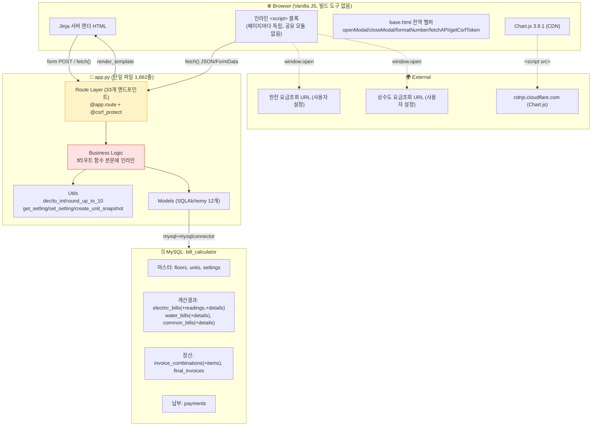
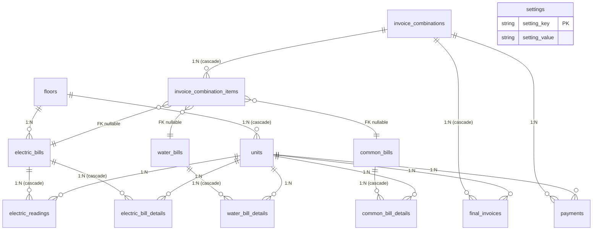
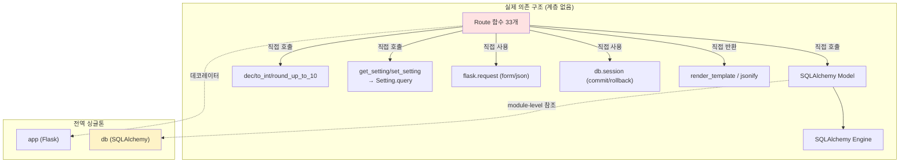

# 01. 현재 Architecture 분석

## 1. 한눈에 보는 전체 구조



**핵심 관찰**: `Business Logic`이 독립 계층으로 존재하지 않는다. 빨간색 블록은 개념상으로만 존재하며, 실제로는 Route 함수 본문에 인라인되어 있다.

---

## 2. 계층(Layer) 실태

**[확인된 사실]** — `app.py` 전체를 라인 범위로 분해하면 다음과 같다.

| 라인 범위 | 역할 | 라인 수 |
|---|---|---|
| 1-71 | import + Decimal 유틸 (`dec`, `to_int`, `to_jsonable`) | 71 |
| 74-124 | Flask/DB 부트스트랩 + `init_database()` | 51 |
| 126-325 | **Model 정의 12개** | 200 |
| 328-350 | CSRF (`generate_csrf_token`, `csrf_protect`) | 23 |
| 353-387 | Utils (`round_up_to_10`, `get/set_setting`, `create_unit_snapshot`, `first_of_month`) | 35 |
| 390-671 | Routes: 홈/설정/층/세대 CRUD | 282 |
| 674-1005 | **Routes: 계산 (전기/수도/공동) ← 핵심 도메인 로직** | 332 |
| 1008-1137 | Routes: 조회/삭제 | 130 |
| 1140-1356 | Routes: 정산서(Invoice) | 217 |
| 1359-1636 | Routes: 납부/잔액/검증 | 278 |
| 1639-1662 | `__main__` 부트스트랩 + `app.run` | 24 |

**Controller / Service / Repository / Domain Model 분리는 존재하지 않는다.**
`Model`만 유일하게 분리된 개념이지만, 이것도 **anemic model**(속성만 있고 메서드 없음)이다. 도메인 규칙은 전부 라우트 함수 안에 있다.

### 계층 부재의 구체적 증거

`calculate_electric` (`app.py:716-860`, 145줄) 한 함수가 수행하는 일:

```mermaid
flowchart LR
    A["HTTP FormData 파싱<br/>720-754"] --> B["중복 검사 & 삭제<br/>756-762"]
    B --> C["ElectricBill 생성/flush<br/>763-776"]
    C --> D["세대 조회 + 검침 저장<br/>778-790"]
    D --> E["TV수신료 배분 계산<br/>792-797"]
    E --> F["복지/바우처 할인 계산<br/>799-820"]
    F --> G["grossing-up<br/>822"]
    G --> H["세대별 비례 배분 + 10원 올림<br/>824-851"]
    H --> I["집계 갱신 + commit<br/>853-856"]
    I --> J["JSON 응답<br/>857"]
```



이 중 **E~H (약 60줄)만이 순수 도메인 로직**이지만, ORM 객체와 `request.form`에 직접 결합되어 있어 **HTTP 요청과 DB 세션 없이는 단 한 줄도 테스트할 수 없다.**

---

## 3. Frontend 구조

### 3.1 렌더링 방식이 페이지마다 다르다 [확인된 사실]

| 페이지 | 렌더링 방식 | 근거 |
|---|---|---|
| `index.html` | 100% Jinja 서버 렌더 (정적) | 전체 |
| `settings.html` | 100% Jinja 서버 렌더 + 모달 폼 | `` (26행) |
| `view_*_detail.html` | 100% Jinja 서버 렌더 | 전체 |
| `invoice_view.html` | 100% Jinja 서버 렌더 (Jinja 필터로 집계까지 수행) | `invoices\|sum(attribute=...)` (124행) |
| `invoice_print.html` | 100% Jinja, **base.html 미상속 독립 HTML** | `<!DOCTYPE html>` 직접 선언 (1행) |
| `view.html` | **서버가 JSON 주입 → JS `innerHTML` 조립** | `const electricBills = {{ ...\|tojson }}` (166행) |
| `calculator.html` | **서버가 JSON 주입 → JS가 폼 자체를 동적 생성** | `renderReadingTable()` (511행) |
| `invoice.html` | **JSON 주입 + fetch + JS 조립 (가장 복잡)** | `renderStep2()` async (854행) |
| `payments.html` | **서버 렌더 골격 + fetch로 데이터 채움** | `DOMContentLoaded` 루프 (243행) |

→ 같은 앱 안에 **4가지 렌더링 패러다임**이 공존한다. 리팩토링 시 최대 난관 중 하나.

### 3.2 상태 관리

**[확인된 사실]** 프론트엔드 상태는 **페이지 전역 `let` 변수**로만 관리된다.

| 파일 | 전역 상태 | 용도 |
|---|---|---|
| `calculator.html:275-279` | `FLOORS`, `UNITS` (const), `monthRowCounter`, `waterExcludedUnits`(Set) | 층/세대 캐시, 동적 행 ID, 수도 제외 세대 |
| `invoice.html:768-771` | `UNITS`, `FLOORS`, `selectedItems`, `unitAdditionalData` | 위저드 3-step 간 데이터 전달 |
| `invoice.html:1008` | `chargeCounter` | **선언되어 있으나 사용되지 않음** (실제 ID는 `Date.now()` 사용) |
| `view.html:170-171` | `electricChart`, `waterChart` | Chart 인스턴스 |
| `payments.html:235-236` | `currentUnitId`, `currentHistory` | 선택 세대 컨텍스트 |

**상태 저장소·이벤트 버스·라우터 없음.** 페이지 이동 = 전체 리로드 = 상태 전부 소실. 저장 성공 시 `location.reload()`가 일관된 패턴이다 (총 14곳).

**[확인된 사실] DOM이 상태 저장소로 쓰이는 안티패턴**:
`invoice.html`의 이월 항목 관리는 상태를 JS 변수가 아닌 **DOM 속성**에 저장한다.
- `data-is-carryover`, `data-original-balance`, `data-original-text`, `data-original-class`, `data-applied`, `data-balance-value` (`invoice.html:1017,1088-1090,1116-1119`)
- `removeChargeRow()`(1032행)는 이 속성들을 역으로 읽어 `querySelectorAll` + `onclick` 문자열 파싱(`onclickAttr.includes('applyBalance(${unitId},')`, 1050행)으로 원래 버튼을 되찾는다.

이는 **문자열 파싱으로 컴포넌트 관계를 복원**하는 구조로, 리팩토링 시 가장 깨지기 쉬운 지점이다.

### 3.3 UI에 섞인 비즈니스 로직 [확인된 사실] ⚠️

프레젠테이션이 아닌 **도메인 판단이 프론트엔드에 있는 지점**:

| 위치 | 로직 | 문제 |
|---|---|---|
| `invoice.html:1092-1094` | `type = balance > 0 ? 'charge' : 'refund'`, 설명문 `'[이월] 전월 미납금'` 생성 | **이월 항목의 description 문자열을 FE가 결정**. BE는 이 문자열을 키워드 매칭으로 재해석 → 계약이 문자열 |
| `invoice.html:1147-1148` | `if (type === 'refund') amount = -Math.abs(amount)` | 부호 규칙(환급=음수)이 FE에만 존재 |
| `calculator.html:664-677` | 사용량 음수 판정 → `data-invalid` 마킹 → 제출 차단(894행) | **유일한 검증이 FE에만 존재**. BE에 음수 사용량 검증 없음 |
| `calculator.html:393-408` | TV 모드가 INDIVIDUAL이면 입력칸 disabled + 값 0 강제 | 배분 모드 규칙 일부가 FE에 |
| `invoice_view.html:124-136` | Jinja 필터로 합계 산출 `invoices\|sum(attribute='electric_amount')` | 집계가 템플릿에 |
| `view_electric_detail.html:116` | 세대별 평균 = 합계/세대수 계산 | 집계가 템플릿에 |

---

## 4. Backend 구조

### 4.1 엔드포인트 전수 (33개) [확인된 사실]

| # | Method | Path | 함수 | CSRF | 응답 |
|---|---|---|---|---|---|
| 1 | GET | `/` | `index` | - | HTML |
| 2 | GET | `/settings` | `settings_page` | - | HTML |
| 3 | POST | `/settings/save` | `save_settings` | ✅ | Redirect+flash |
| 4 | GET | `/settings/export` | `export_settings` | - | JSON |
| 5 | POST | `/settings/import` | `import_settings` | ✅ | JSON |
| 6 | POST | `/floors/add` | `add_floor` | ✅ | JSON |
| 7 | POST | `/floors/<id>/update` | `update_floor` | ✅ | JSON |
| 8 | POST | `/floors/<id>/delete` | `delete_floor` | ✅ | JSON |
| 9 | POST | `/units/add` | `add_unit` | ✅ | JSON |
| 10 | POST | `/units/<id>/update` | `update_unit` | ✅ | JSON |
| 11 | POST | `/units/<id>/delete` | `delete_unit` | ✅ | JSON |
| 12 | GET | `/calculator` | `calculator` | - | HTML |
| 13 | POST | `/calculate/electric` | `calculate_electric` | ✅ | JSON |
| 14 | POST | `/calculate/water` | `calculate_water` | ✅ | JSON |
| 15 | POST | `/calculate/common` | `calculate_common` | ✅ | JSON |
| 16 | GET | `/view` | `view_bills` | - | HTML |
| 17 | GET | `/view/electric/<id>` | `view_electric_detail` | - | HTML |
| 18 | GET | `/view/water/<id>` | `view_water_detail` | - | HTML |
| 19 | GET | `/view/common/<id>` | `view_common_detail` | - | HTML |
| 20 | POST | `/bills/delete/<type>/<id>` | `delete_bill` | ✅ | JSON |
| 21 | GET | `/invoice` | `invoice_combination` | - | HTML |
| 22 | POST | `/invoice/create` | `create_invoice` | ✅ | JSON |
| 23 | GET | `/invoice/view/<id>` | `view_invoice` | - | HTML |
| 24 | GET | `/invoice/print/<id>` | `print_invoice` | - | HTML |
| 25 | POST | `/invoice/delete/<id>` | `delete_invoice` | ✅ | JSON |
| 26 | GET | `/get_previous_readings/<floor_id>/<month>` | `get_previous_readings` | - | JSON |
| 27 | GET | `/payments` | `payments` | - | HTML |
| 28 | GET | `/payments/unit_history/<id>` | `payment_unit_history` | - | JSON |
| 29 | GET | `/payments/balance/<id>` | `payment_balance` | - | JSON |
| 30 | POST | `/payments/add` | `add_payment` | ✅ | JSON |
| 31 | POST | `/payments/update/<id>` | `update_payment` | ✅ | JSON |
| 32 | POST | `/payments/delete/<id>` | `delete_payment` | ✅ | JSON |
| 33 | GET | `/payments/all_units_balance` | `all_units_balance` | - | JSON |
| 34 | GET | `/admin/validate_balances` | `validate_balances` | - | JSON |

**[확인된 사실]** URL 명명 규칙이 3가지가 섞여 있다:
- 리소스형: `/floors/<id>/delete`, `/units/<id>/update`
- 동사형: `/calculate/electric`, `/get_previous_readings/...`
- 동사-리소스 혼합형: `/bills/delete/<type>/<id>`, `/invoice/create`

REST 스타일도 RPC 스타일도 아니다.

**[확인된 사실]** 인증/인가는 **어떤 엔드포인트에도 없다.** `/admin/validate_balances`도 인증 없이 접근 가능하다.

### 4.2 응답 계약의 불일치 [확인된 사실]

두 가지 실패 표현이 혼재한다:

| 방식 | 사용처 | 예시 |
|---|---|---|
| **HTTP 200 + `{success: false}`** | 라우트 32개 대부분 | `app.py:566` `return jsonify({'success': False, 'message': ...})` |
| **HTTP 403 + `{success: false}`** | CSRF 실패만 | `app.py:347` |
| **HTTP 404 (Flask abort)** | `get_or_404` 12곳 | `app.py:573,605,645,...` — HTML 404 페이지가 반환되어 `res.json()`이 파싱 실패 |

→ 프론트엔드는 `res.json()`을 무조건 호출하므로, `get_or_404` 경로에서는 **`Unexpected token '<'` 파싱 에러**로 떨어진다. (`payments.html:483`, `invoice.html` 등 catch 블록이 있는 곳만 겨우 방어)

---

## 5. Database 구조



### 5.1 스키마 관리 방식 [확인된 사실] ⚠️

**세 가지 소스가 서로 불일치한다.**

| 소스 | 역할 | 상태 |
|---|---|---|
| `app.py` 모델 (129-325행) | **실질적 Single Source of Truth**. `db.create_all()`이 이걸로 생성 | 최신 |
| `SQLSchema.txt` | 수동 DDL 스크립트 | **Stale — 아래 참조** |
| 실제 MySQL DB | 런타임 상태 | 검증 불가 (자격증명 접근 실패) |

**`SQLSchema.txt`의 구체적 불일치 [확인된 사실]:**

| 항목 | 모델 (`app.py`) | `SQLSchema.txt` |
|---|---|---|
| `floors.electric_contract_number` | 있음 (134행) | **없음** |
| `invoice_combination_items` 키 구조 | `electric_bill_id` / `water_bill_id` / `common_bill_id` 3개 nullable FK (285-287행) | `item_id INT NOT NULL` 단일 컬럼 (216행) |
| `invoice_combination_items.item_type` | `String(20)` (280행) | `ENUM('ELECTRIC','WATER','COMMON')` (215행) |
| `final_invoices.additional_charges` | 있음 JSON (304행) | **없음** |
| `final_invoices.unit_memo` | 있음 Text (307행) | **없음** |
| `payments` 테이블 | 있음 (313행) | 있음 (346행, 파일 끝에 뒤늦게 추가) |
| FK `ON DELETE` 정책 | `db.create_all()` 기본값 = **RESTRICT** | 명시적 **CASCADE** |

**마지막 항목이 특히 위험하다.** `SQLSchema.txt`로 DB를 만들면 세대 삭제 시 과거 정산 내역이 **연쇄 삭제**되고, `db.create_all()`로 만들면 **IntegrityError로 삭제 실패**한다. 즉 **동일한 코드가 DB 생성 방식에 따라 정반대로 동작한다.**

또한 `SQLSchema.txt`는 파일 상단에서 `DROP TABLE IF EXISTS` 를 전부 수행하므로(16-37행), **실수로 실행하면 전체 데이터가 소실**된다.

### 5.2 JSON 컬럼 (스키마 없는 데이터) [확인된 사실]

| 테이블.컬럼 | 구조 | 생성 위치 | 소비 위치 |
|---|---|---|---|
| `electric_bills.monthly_details` | `[{month, amount, welfare, voucher, tv_fee}]` | `app.py:740-746` | `view.html:203`, `invoice.html:543`, `invoice_view.html:153`, `invoice_print.html:307`, `view_electric_detail.html:35` |
| `*_bill_details.unit_snapshot` | `{unit_name, electric_welfare, electric_voucher, has_tv, water_welfare, residents_count, is_vacant}` | `app.py:374-383` | `view_water_detail.html:158`, `view_common_detail.html:50,83,96` |
| `final_invoices.common_details` | `[{description, amount}]` | `app.py:1236-1239` | `invoice_print.html:376` |
| `final_invoices.additional_charges` | `[{description, amount}]` | `app.py:1249-1252` | `app.py:1402,1454,1558,1606` (키워드 매칭), `invoice_view.html:244`, `invoice_print.html:391` |

**[확인된 사실] `monthly_details`의 `month` 필드는 타입이 불안정하다.** `invoice_view.html:157`에 `` 분기가 있는데, 이는 과거 데이터에 `date` 객체와 문자열이 섞여 있었음을 시사한다 [강한 추론].

---

## 6. 의존 관계 그래프



### 발견된 결합 문제 [확인된 사실]

| 문제 | 위치 | 설명 |
|---|---|---|
| **전역 싱글톤 `db`** | `app.py:110` | 모든 모델·라우트가 module-level `db`에 결합. 테스트용 별도 세션 주입 불가 |
| **UI ↔ 비즈니스 로직 직결** | `calculate_*` 3개 | `request.form` 파싱과 계산이 같은 함수 |
| **DB ↔ UI 직결** | `view_invoice`, `invoice_view.html` | ORM 객체를 템플릿에 그대로 넘겨 템플릿이 lazy-load 트리거 |
| **설정 접근이 DB 직결** | `get_setting` (`app.py:360`) | 호출마다 `SELECT` 발생. `calculate_electric` 한 번에 최대 3회 |
| **문자열 계약** | `app.py:1405,1457,1561,1611` ↔ `invoice.html:1094` | 이월 판정 키워드가 FE 생성 문자열에 의존 |
| **중복 코드 4벌** | `app.py:1396-1408`, `1447-1460`, `1551-1564`, `1596-1614` | 잔액 계산 로직이 4곳에 복붙되어 있고 **미묘하게 다르다** (04-data-flow.md 참조) |

**순환 의존(circular dependency)은 없다** — 파일이 하나뿐이라 구조적으로 불가능하다.

---

## 7. 동시성·비동기

**[확인된 사실]**

| 항목 | 상태 |
|---|---|
| Thread / Process / asyncio | **없음** |
| Background job / Scheduler / Queue | **없음** |
| WebSocket / SSE / Polling | **없음** |
| Flask 실행 모드 | `app.run(debug=True)` — Werkzeug 개발 서버, 기본 threaded=True |
| DB 트랜잭션 | 라우트마다 `db.session.commit()` / `rollback()` 수동 |
| 락 / 낙관적 동시성 제어 | **없음** (`version_id_col` 미사용) |

**[강한 추론] 동시성 위험은 낮지만 0은 아니다.** 단일 사용자 전제이므로 실질적 경합은 드물다. 다만 다음은 이론적으로 가능:
- `calculate_electric`의 "존재 확인(756행) → 삭제(760행) → 생성(775행)" 사이에 TOCTOU 창이 있다. DB의 `UNIQUE(floor_id, billing_month)` 제약이 최후 방어선이지만, 모델에는 이 제약이 선언되어 있지 않아 `db.create_all()`로 만든 DB에는 **제약 자체가 없을 수 있다**.
- `payments.html:243-272`가 세대 수만큼 `await fetch`를 **순차** 실행한다. 30세대면 30번의 왕복. UI 블로킹은 아니지만 체감 지연이 크다.

**프론트엔드 비동기**: 전부 `async/await` + `fetch`. `AbortController`·타임아웃·로딩 인디케이터·재시도 **전무**. 실패는 `alert()`로만 통보된다.

---

## 8. 오류 처리 구조

**[확인된 사실]** 지배적 패턴은 **"전체를 try로 감싸고 `except Exception as e` 로 문자열화"** 이다. `app.py`에 `except Exception` 27회 등장.

```python
# app.py 전역에 반복되는 형태 (예: 601-611행)
try:
    ...
    db.session.commit()
    return jsonify({'success': True, 'message': '...'})
except Exception as e:
    db.session.rollback()
    return jsonify({'success': False, 'message': str(e)})   # ← 내부 예외를 그대로 사용자에게
```

### 분류

| 분류 | 실태 |
|---|---|
| **사용자에게 알려야 하는 오류** | `alert(j.message)` — 전부 동일하게 처리. 복구 가이드 없음 |
| **복구 가능한 오류** | 구분 없음. 검증 실패와 DB 장애가 같은 형태로 응답됨 |
| **재시도 가능한 오류** | 재시도 로직 **없음** (`pool_pre_ping=True`만 설정, `app.py:109`) |
| **시스템 중단이 필요한 오류** | `init_database()` 실패 시 `print()`만 하고 계속 진행 (`app.py:122-123`) |
| **무시되는 오류** | `app.py:80-104` JSON Provider 설치 실패를 `except: pass`로 삼킴 → Decimal 직렬화가 조용히 깨질 수 있음<br/>`app.py:874-876` `except: except:` bare except로 `excluded_units` 파싱 실패 시 **조용히 빈 set**(= 아무도 제외되지 않음) |
| **글로벌 핸들러** | `@app.errorhandler` **없음**. 404/500은 Flask 기본 HTML |
| **로깅** | `logging` 모듈 미사용. `print()` 2회(`app.py:123,1660`)가 전부 |

**[확인된 사실] 가장 위험한 침묵 실패**: `app.py:872-876`

```python
excluded_units_json = request.form.get('excluded_units', '[]')
try:
    excluded_unit_ids = set(map(int, json.loads(excluded_units_json)))
except:                       # ← bare except
    excluded_unit_ids = set() # ← 제외 세대가 전부 사라짐
```

파싱이 실패하면 **사용자가 제외한 세대가 전부 정산 대상에 포함**되어 잘못된 금액이 청구된다. 사용자는 이를 알 방법이 없다.

---

## 9. 테스트 구조

**[확인된 사실] 테스트는 0개다.**
- `tests/`, `test_*.py`, `*_test.py`, `conftest.py` 전부 부재
- pytest / unittest import 없음
- CI 설정(`.github/`, `.gitlab-ci.yml`) 없음
- 린터/포매터 설정(`setup.cfg`, `pyproject.toml`, `.flake8`) 없음
- 커버리지 추정: **0%**

금액을 계산하고 청구서를 발행하는 시스템에 회귀 방어 장치가 전무하다. 리팩토링 착수 전 최우선 과제이며, 무엇을 먼저 고정해야 하는지는 [07-refactoring-foundation.md](07-refactoring-foundation.md)에 정리했다.
