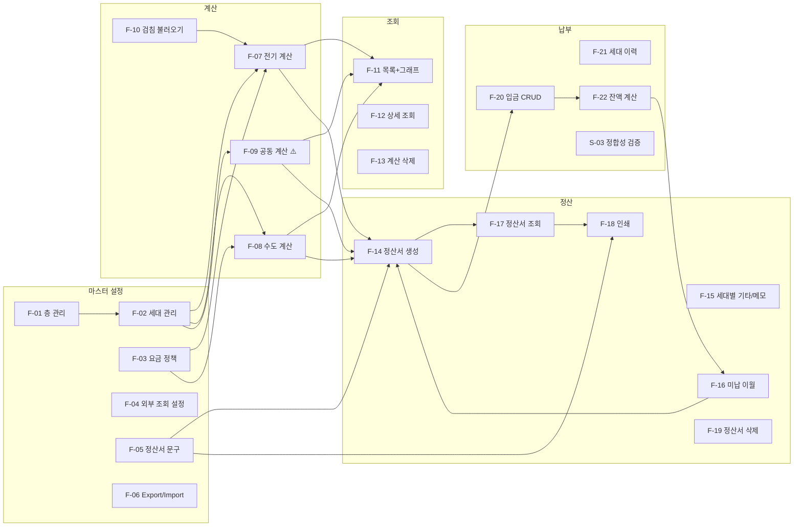

# 02. 기능 인벤토리

현재 구현된 모든 기능을 **사용자/시스템 관점의 의미 단위**로 정리한다.
`F-xx` = 사용자 기능, `S-xx` = 운영/보조 기능.

> ⚠️ 표시가 있는 항목은 **현재 코드에서 의도대로 동작하지 않는 것으로 확인된 기능**이다. 상세는 [06-technical-debt.md](06-technical-debt.md).

---

## 기능 지도



---

## F-01. 층(Floor) 관리

| 항목 | 내용 |
|---|---|
| **목적** | 건물의 층 구조 정의. 전기요금이 층 단위로 고지되므로 전기 계산의 기준 단위가 된다 |
| **사용자 입력** | 층 번호(정수, 지하는 음수), 층 이름(선택), 전기 계약번호(선택) |
| **내부 처리** | 층 번호 중복 검사 → 이름 미입력 시 자동 생성(`B{n}층`/`{n}층`) → INSERT |
| **출력** | JSON `{success, message}` → `location.reload()` |
| **관련 UI** | `settings.html:23,353-377`(추가 모달), `461-486`(수정 모달), `40-46`(액션 버튼) |
| **관련 파일/함수** | `app.py:535 add_floor`, `569 update_floor`, `601 delete_floor` |
| **데이터** | `floors(floor_number UNIQUE, name, electric_contract_number)` |
| **관계** | 삭제 시 `cascade='all, delete-orphan'`로 `units` 연쇄 삭제 (`app.py:137`). 단, `units`를 참조하는 계산 상세가 있으면 FK RESTRICT로 실패 |

**[확인된 사실]** 층 번호는 `to_int(x, None)`로 파싱하며 실패 시 `None` 반환 → 명시적 에러 메시지. 음수 지원(지하층).

---

## F-02. 세대(Unit) 관리

| 항목 | 내용 |
|---|---|
| **목적** | 정산의 최소 단위 정의. 모든 배분 계산의 대상 |
| **사용자 입력** | 세대명, 거주인원, 전기복지☑, 전기바우처☑, TV보유☑, 수도복지☑, 공실☑, 비고 |
| **내부 처리** | 체크박스를 FE에서 `'true'`/`'false'` 문자열로 정규화(`settings.html:577-581`) → BE는 `== 'true'` 비교(`app.py:626-631`) |
| **출력** | JSON → reload |
| **관련 UI** | `settings.html:380-458`(추가/수정 모달), `50-105`(층별 세대 테이블) |
| **관련 파일/함수** | `app.py:614 add_unit`, `641 update_unit`, `661 delete_unit` |
| **데이터** | `units(floor_id, unit_name, memo, electric_welfare, electric_voucher, has_tv, water_welfare, residents_count, is_vacant)` |
| **다른 기능과의 관계** | 각 속성이 계산 로직의 분기 조건이 된다:<br/>· `is_vacant` → 모든 계산에서 제외<br/>· `electric_welfare/voucher` → 전기 할인 대상<br/>· `has_tv` → TV 개별 부과 대상<br/>· `water_welfare` → 수도 할인 대상<br/>· `residents_count` → 수도/공동 배분 가중치<br/>· `memo` → 정산서에 "세대 비고"로 표시 |

**[확인된 사실] 세대 속성 변경은 소급되지 않는다.** 계산 시점의 값이 `unit_snapshot` JSON으로 상세 레코드에 박제된다(`create_unit_snapshot`, `app.py:374`). 이는 **의도된 설계이며 반드시 보존해야 한다.**

**[확인된 사실] 세대 수정 시 `memo` 기본값 버그성 동작**: `app.py:647` `unit.memo = request.form.get('memo', '')` — 다른 필드는 `request.form.get(k, 기존값)` 패턴인데 memo만 `''`. 폼에 memo 필드가 없는 요청이 오면 메모가 지워진다. (현재 UI는 항상 보내므로 발현되지 않음)

---

## F-03. 요금 정책 설정

| 항목 | 내용 |
|---|---|
| **목적** | 계산에 쓰이는 단가 정의 |
| **사용자 입력** | TV 수신료(세대당), 전기 복지 할인액, 전기 바우처 할인액, 수도 복지 할인액 |
| **내부 처리** | `set_setting(key, str(value))` → `settings` 테이블 upsert |
| **출력** | flash 메시지 + redirect |
| **관련 UI** | `settings.html:129-173` (요금 설정 탭) |
| **관련 파일/함수** | `app.py:425 save_settings`, `360 get_setting`, `365 set_setting` |
| **데이터** | `settings(setting_key UNIQUE, setting_value VARCHAR(255))` — **EAV 방식, 전부 문자열** |
| **소비처** | `app.py:792`(tv_fee), `806`(electric_welfare_amount), `816`(electric_voucher_amount), `909`(water_welfare_amount) |

**[확인된 사실] 설정 탭 간 덮어쓰기 위험**: 설정 페이지의 4개 탭이 각각 **독립 `<form>`이면서 다른 탭의 값을 hidden input으로 전부 전송**한다(`settings.html:139-144, 187-193, 249-256`). `save_settings`는 무조건 9개 키를 전부 덮어쓰므로, 페이지를 오래 열어둔 상태에서 다른 창에서 설정을 바꾸면 **stale 값으로 되돌아간다.**

---

## F-04. 외부 요금 조회 설정

| 항목 | 내용 |
|---|---|
| **목적** | 한전/상수도 요금 조회 페이지를 계산기에서 바로 열기 |
| **사용자 입력** | 전기 조회 URL, 수도 조회 URL, 주택 수도 고객번호 |
| **내부 처리** | settings 저장. **URL 검증 없음** |
| **출력** | 계산기 페이지 상단에 "🔍 요금 조회" 버튼 조건부 렌더 |
| **관련 UI** | `settings.html:176-236`, `calculator.html:19-24`(전기), `135-140`(수도), `703,712`(고객번호 표시) |
| **관련 파일/함수** | `app.py:406-422 settings_page`, `705-713 calculator` |
| **외부 의존성** | 사용자가 지정한 임의의 외부 사이트. `window.open(url, '_blank')` |

**[확인된 사실] XSS 벡터**: `calculator.html:21`이 `onclick="window.open('{{ electric_bill_url }}', '_blank')"` 로 URL을 **JS 문자열 리터럴 안**에 삽입한다. Jinja 자동이스케이프는 HTML 컨텍스트용이라 `'` 를 `&#39;`로 바꾸긴 하지만, HTML 속성 안의 JS 컨텍스트에서는 브라우저가 이를 디코드한 뒤 JS로 파싱하므로 **`javascript:` 스킴이나 따옴표 탈출이 가능하다**. 단일 사용자 앱이라 실질 위험은 낮으나 구조적 결함이다. `calculator.html:703`의 `const waterCustomerNumber = '{{ water_customer_number }}';` 도 동일 패턴.

---

## F-05. 정산서 문구 설정

| 항목 | 내용 |
|---|---|
| **목적** | 모든 정산서에 공통으로 들어갈 안내문 정의 |
| **사용자 입력** | 고정 메모(`invoice_default_memo`), 인쇄용 푸터(`invoice_footer`) |
| **내부 처리** | 정산서 생성 시 `f"{default_memo}\n\n{user_memo}"` 로 결합 (`app.py:1184-1189`) |
| **출력** | 설정 페이지 실시간 미리보기(`settings.html:268-296`), 정산서/인쇄물 렌더 |
| **관련 파일/함수** | `app.py:1181-1189 create_invoice`, `1318 print_invoice` |
| **관계** | 결합된 메모는 `invoice_combinations.memo` **와** 각 `final_invoices.memo` **양쪽에 중복 저장**된다 (`app.py:1191`, `1270`). 실제 렌더는 `combination.memo`만 사용(`invoice_print.html:422`) → `final_invoices.memo`는 사실상 **데드 데이터** |

**[확인된 사실] 기본값 문자열 불일치**: `settings_page`는 `'* 사용자 지정 Footer를 설정메뉴에서 설정 할 수 있습니다.'`(`app.py:416`), `print_invoice`는 `'* Footer 문구를 설정에서 커스텀 할 수 있습니다.'`(`app.py:1318`), `__main__` 부트스트랩도 후자(`app.py:1653`). 3곳에 하드코딩.

---

## F-06. 설정 Export / Import

| 항목 | 내용 |
|---|---|
| **목적** | 층/세대/요금 설정 백업·복원 |
| **사용자 입력** | (Export) 없음 / (Import) JSON 파일 |
| **내부 처리** | **Export**: settings 9키 + 층·세대 트리를 JSON 직렬화<br/>**Import**: ❗**모든 Floor 삭제** → settings 덮어쓰기 → 층/세대 재생성 |
| **출력** | (Export) `settings_YYYY-MM-DD.json` 다운로드 / (Import) JSON |
| **관련 UI** | `settings.html:304-347`, `642-689`(JS) |
| **관련 파일/함수** | `app.py:448 export_settings`, `485 import_settings` |

**[확인된 사실] Import는 매우 위험한 파괴적 연산이다** (`app.py:490-492`):
```python
for f in Floor.query.all():
    db.session.delete(f)
db.session.flush()
```
- `Floor` → `Unit` cascade 삭제가 발생한다.
- `db.create_all()`로 만든 DB라면 FK RESTRICT에 걸려 **IntegrityError → 전체 롤백** (데이터는 안전하지만 Import 자체가 실패).
- `SQLSchema.txt`로 만든 DB라면 FK가 CASCADE이므로 **모든 전기/수도/공동 계산 상세, 정산서, 납부 내역이 연쇄 삭제**된다.

→ **동일 기능이 DB 생성 방식에 따라 "실패"하거나 "전체 데이터 소실"로 갈린다.** Critical.

또한 Export는 세대 **id를 포함하지 않으므로**, Import 후 세대 id가 전부 바뀐다. 기존 계산 상세의 `unit_id` 참조는 복원 불가능하다.

---

## F-07. 전기요금 계산 ⭐ 핵심

| 항목 | 내용 |
|---|---|
| **목적** | 층 단위 전기 고지액을 세대 계량기 사용량 비율로 배분 |
| **사용자 입력** | 정산월, 층, TV 배분 모드, **월별 고지 내역 N행**(고지월/전기요금/복지할인/바우처할인/TV수신료총액), **세대별 전월·현월 검침값**, 덮어쓰기☑ |
| **출력** | `electric_bills` 1건 + `electric_readings` N건 + `electric_bill_details` N건 |
| **관련 UI** | `calculator.html:14-127`(폼), `307-356`(월 행 추가), `511-688`(검침표 동적 생성), `879-921`(제출) |
| **관련 파일/함수** | `app.py:716 calculate_electric` |
| **핵심 데이터** | `ElectricBill.monthly_details` JSON, `ElectricBillDetail(usage_amount, base_amount, welfare_discount, voucher_discount, tv_fee, final_amount, charged_amount, unit_snapshot)` |

### 계산 알고리즘 [확인된 사실] — `app.py:726-856`

```
① 월별 행 수집 (동적 rowId)
   for key in request.form:  if key.startswith('bill_month_'): rowId 추출
   total_amount    = Σ amount
   welfare_input   = Σ welfare
   voucher_input   = Σ voucher
   tv_fee_total    = Σ tv_fee

② 중복 확인 (floor_id, billing_month)  → 존재 & overwrite≠'true' → 거부
                                       → 존재 & overwrite=='true' → DELETE

③ 대상 세대 = floor.units 중 is_vacant=False        (※ 검침은 재실 세대만)
   total_usage = Σ (curr - prev)

④ TV 수신료
   EQUAL      : tv_fee_per_unit = tv_fee_total / len(units)         ← 전 재실 세대 균등
   INDIVIDUAL : tv_fee_per_unit = setting(tv_fee) × month_count     ← has_tv 세대만

⑤ 할인 단가 (입력값 우선, 없으면 설정값 × 개월수)
   welfare_per_unit = welfare_input / len(welfare_units)     (welfare_input > 0)
                    | setting(electric_welfare_amount) × month_count
   voucher_per_unit = (동일 구조)

⑥ Grossing-up
   original_amount = total_amount + total_welfare_to_apply + total_voucher_to_apply

⑦ 세대별
   usage        = curr - prev
   base_amount  = (usage / total_usage) × original_amount     ← total_usage=0이면 균등분할
   final_amount = base_amount - 세대복지 - 세대바우처 + 세대TV      ← 음수면 0으로 clamp
   charged      = ceil(final_amount / 10) × 10
```

### 관련 서브기능

- **N개월 묶음 정산**: `+ 월 추가` 버튼으로 행 무제한 추가. `month_count` hidden에 행 수 반영(`calculator.html:367-370`). 한 번에 밀린 고지를 처리
- **TV 배분 2모드**: 드롭다운 변경 시 TV 입력칸 활성/비활성 토글(`calculator.html:393-408`)
- **세대 정보 카드**: 층 선택 시 재실/공실/TV/복지/바우처 집계 + 세대 카드 렌더(`calculator.html:411-508`)
- **음수 사용량 방어**: 입력 시 실시간 검사 → 빨간 테두리 + `data-invalid` → 제출 차단(`calculator.html:664-677, 894-898`)

### ⚠️ 확인된 결함

1. **덮어쓰기가 절대 동작하지 않는다** [확인된 사실]
   - 체크박스 `<input type="checkbox" name="overwrite">`에 `value` 속성이 없다(`calculator.html:113`) → 체크 시 브라우저가 `"on"` 전송
   - BE는 `request.form.get('overwrite') != 'true'` 로 검사(`app.py:757`) → `"on" != "true"` → **항상 거부**
   - FE 재시도 분기는 `j.already_exists`를 확인하는데(`calculator.html:906`) BE는 `exists` 키를 반환(`app.py:758`) → **재시도 경로도 죽어 있음**
   - 결과: 특정 (층, 정산월)에 대해 **한 번 계산하면 두 번 다시 계산할 수 없다.** 잘못 입력하면 조회 페이지에서 수동 삭제 후 재입력해야 한다.
   - 참고: 수도 탭은 FE가 `fd.set('overwrite', ...'true'/'false')`로 명시 변환하므로(`calculator.html:929`) **정상 동작**한다. 전기 탭만 누락.

2. **`month_count` 이중 정의** [확인된 사실]
   - `bill.billing_months_count = len(monthly_details)` (`app.py:772`) — 실제 행 수
   - `month_count = to_int(request.form.get('month_count','1'), 1)` (`app.py:732`) — FE hidden 값
   - 두 값이 각각 다른 계산에 쓰인다(후자는 TV/할인 단가 곱셈에). 정상 흐름에선 같지만 **동기화 보장이 없다**.

---

## F-08. 수도요금 계산

| 항목 | 내용 |
|---|---|
| **목적** | 건물 전체 수도 고지액을 거주 인원수 비율로 배분 |
| **사용자 입력** | 정산월, 수도 총액, 복지 할인 총액, **정산 제외 세대 선택**, 덮어쓰기☑ |
| **출력** | `water_bills` 1건 + `water_bill_details` N건(제외 세대 포함, 금액 0) |
| **관련 UI** | `calculator.html:130-191`, `691-830`(세대 선택 카드 + 토글) |
| **관련 파일/함수** | `app.py:863 calculate_water` |

### 계산 알고리즘 [확인된 사실] — `app.py:894-959`

```
all_units      = 전체 재실 세대
included       = all_units - excluded_unit_ids
total_residents= Σ included.residents_count
welfare_units  = included 중 water_welfare

welfare_per_unit = welfare_input / len(welfare_units)  (입력값>0)
                 | setting(water_welfare_amount)        (개월수 곱 없음 ← 전기와 다름)

original_amount = total_amount + total_welfare_to_apply

제외 세대  → base=0, welfare=0, final=0, charged=0, is_excluded=True
포함 세대  → base = (residents / total_residents) × original_amount
            final = base - 세대복지  (음수면 0)
            charged = ceil(final/10)×10
```

**[확인된 사실] 전기와의 비대칭**: 전기는 할인 설정값에 `× month_count`를 곱하지만(`app.py:806,816`) 수도는 곱하지 않는다(`app.py:909`). 수도에는 묶음 정산 개념이 없기 때문으로 보이나 [강한 추론], 규칙이 문서화되어 있지 않다.

**[확인된 사실] 세대 제외 정보는 UI 상태로만 존재한다**: `waterExcludedUnits` Set이 hidden input `excluded_units`에 JSON 배열로 직렬화되어 전송된다(`calculator.html:806-830`). 페이지를 새로고침하면 선택이 초기화된다. 지난달 제외 세대를 기억하는 기능은 없다.

---

## F-09. 공동 공과금 계산 ⚠️ **동작 파손**

| 항목 | 내용 |
|---|---|
| **목적** | 인터넷/관리비/기타 비정기 비용을 인원 비례 또는 세대 균등으로 배분 |
| **관련 UI** | `calculator.html:194-268`, `952-972`(제출) |
| **관련 파일/함수** | `app.py:968 calculate_common` |

### ⚠️ FE/BE 계약이 완전히 어긋나 있다 [확인된 사실]

| BE가 읽는 필드 (`app.py:972-975`) | FE가 보내는 필드 (`calculator.html:202-240`) | 결과 |
|---|---|---|
| `billing_month` | `billing_month` ✅ | 정상 |
| `description` | **없음** | `None` 저장 |
| `total_amount` | **없음** (`internet_amount`/`management_amount`/`other_amount` 3개로 분리) | `dec(None)` → **총액 0원** |
| `distribution_method` (`BY_RESIDENTS`/`BY_UNITS`) | `distribution_mode` (`RESIDENTS`/`UNIT`) | 기본값 `BY_RESIDENTS` 고정 |

**결과**: 공동 공과금을 저장하면 `total_amount=0`, `description=NULL`, 모든 세대 배분액 0원인 레코드가 생성되고, **"공동 공과금이 계산되었습니다."라는 성공 메시지가 표시된다.** 사용자는 실패를 인지할 방법이 없다.

### 회귀 시점 추적 [확인된 사실]

```
542ddac (initial)    : description ✅ total_amount ✅ distribution_method ✅   → 정상
ef3a627 (UI 폴리싱 2차): distribution_method → distribution_mode 로 이름 변경   → 분배방식 파손
e4542c7 (UI 폴리싱 3차): description/total_amount 제거, 3개 항목 입력으로 교체 → 총액 파손
```

두 커밋 모두 커밋 메시지가 "계산기 페이지 UI 폴리싱"이다. **UI만 손본다고 생각한 변경이 백엔드 계약을 깼고, 테스트가 없어 아무도 알아채지 못했다.** 이 프로젝트의 기술 부채 구조를 상징하는 사례다.

### 부수 문제

- **중복 검사 없음**: 전기/수도와 달리 같은 월에 몇 번이든 중복 생성된다(`app.py:977-980`에 `existing` 검사 부재)
- **`round_up_to_10`가 배분액에만 적용**되어 합계가 총액을 초과한다(전기/수도도 동일)

---

## F-10. 이전 검침값 자동 불러오기

| 항목 | 내용 |
|---|---|
| **목적** | 전월 검침 입력 수고 제거 |
| **사용자 입력** | (버튼 클릭) 정산월 + 층이 선택되어 있어야 함 |
| **내부 처리** | 해당 층의 `billing_month < 현재월` 중 최신 `ElectricBill` 조회 → 각 reading의 `current_reading`을 `{unit_id: value}`로 반환 |
| **출력** | 전월 검침 입력칸 자동 채움 + `input` 이벤트 강제 발화로 사용량 재계산 |
| **관련 UI** | `calculator.html:546-549`(버튼), `832-861`(fetch) |
| **관련 파일/함수** | `app.py:1341 get_previous_readings` |

**[확인된 사실]** GET 엔드포인트이며 CSRF 불필요. 이전 정산이 없으면 빈 객체 반환 후 "불러왔습니다" alert이 뜬다(빈 결과와 성공이 구분되지 않음).

---

## F-11. 정산 내역 목록 + 추이 그래프

| 항목 | 내용 |
|---|---|
| **목적** | 전기/수도/공동 계산 결과 전체 조회 및 시각화 |
| **내부 처리** | BE가 **전체 bill을 JSON으로 직렬화**하여 템플릿에 주입 → JS가 `innerHTML`로 테이블 조립 |
| **출력** | 3개 탭(전기/수도/공동) 테이블 + Chart.js 라인 차트 2개 |
| **관련 UI** | `view.html` 전체 |
| **관련 파일/함수** | `app.py:1011 view_bills` |
| **외부 의존성** | Chart.js 3.9.1 (cdnjs CDN) — **오프라인 시 차트 영역 공백** |

**전기 차트 로직** (`view.html:181-259`): `monthly_details`를 펼쳐 **고지월(정산월 아님) 기준**으로 층별 라인을 그린다. 같은 고지월이 여러 정산에 중복 등장하면 합산된다(`view.html:208-212`).

**[확인된 사실] 성능 문제**: `view_bills`는 모든 `ElectricBill`의 **모든 detail**을 JSON으로 직렬화한다(`app.py:1038-1050`). 30세대 × 24개월 = 720행이 매 페이지 로드마다 HTML에 인라인된다. 페이지네이션·필터링 없음. `selected_month`/`selected_floor`/`selected_unit` 파라미터를 템플릿에 넘기지만(`app.py:1089-1091`) **템플릿에서 사용되지 않는 데드 코드**다.

---

## F-12. 항목별 상세 조회

| 대상 | 라우트 | 템플릿 | 표시 내용 |
|---|---|---|---|
| 전기 | `app.py:1094` | `view_electric_detail.html` | 월별 고지 내역 테이블(2개월 이상일 때), 청구/정산 요약, 세대별 검침·배분·할인·TV·최종·청구액, 계산식 안내 |
| 수도 | `app.py:1106` | `view_water_detail.html` | 정산/제외 세대수, 제외 세대 명단, 세대별 배분·할인·청구액 |
| 공동 | `app.py:1113` | `view_common_detail.html` | 분배 방식, 세대별 인원(스냅샷)·배분액·청구액 |

**[확인된 사실]** 세 템플릿 모두 **`unit_snapshot`의 거주인원을 읽어** 과거 시점 값을 표시한다(`view_water_detail.html:158`, `view_common_detail.html:50,83,96`). 스냅샷 설계가 실제로 활용되고 있다.

**[확인된 사실]** `view_electric_detail.html:112,116` 등에서 `details|sum(...)`을 여러 번 반복 호출한다. 소규모라 문제는 없지만 집계가 템플릿에 있다.

---

## F-13. 계산 결과 삭제

| 항목 | 내용 |
|---|---|
| **관련 파일/함수** | `app.py:1120 delete_bill(bill_type, bill_id)` |
| **처리** | `bill_type`으로 모델 분기 → `db.session.delete` → cascade로 상세/검침 삭제 |
| **관련 UI** | `view.html:567-581 deleteBill()` |

**[확인된 사실] 정산서에 포함된 계산은 삭제할 수 없다**: `invoice_combination_items.electric_bill_id` 등이 FK로 참조 중이면 `db.create_all()` 기준 RESTRICT → `IntegrityError` → `str(e)`가 그대로 alert에 표시된다. 사용자에게는 "무슨 뜻인지 알 수 없는 SQL 에러"로 보인다.

---

## F-14. 정산서(Invoice) 조합 생성 ⭐ 핵심

| 항목 | 내용 |
|---|---|
| **목적** | 여러 계산 결과를 조합해 세대별 최종 청구서를 확정 |
| **사용자 입력** | 정산서 이름, 추가 메모, 포함할 전기/수도/공동 항목 체크, 세대별 기타 항목·메모 |
| **내부 처리** | 3-step 위저드 → 단일 JSON POST → BE가 조합 + 세대별 금액 집계 |
| **출력** | `invoice_combinations` 1건 + `invoice_combination_items` N건 + `final_invoices` (재실 세대 수만큼) |
| **관련 UI** | `invoice.html:475-720`(위저드), `766-1322`(JS 전체) |
| **관련 파일/함수** | `app.py:1175 create_invoice` |

### 처리 흐름 [확인된 사실] — `app.py:1178-1275`

```
① 메모 결합: default_memo + "\n\n" + user_memo
② InvoiceCombination INSERT + flush
③ items 순회 → type별로 electric_bill_id/water_bill_id/common_bill_id 중 하나만 세팅
④ 재실 세대 전체 순회:
     for item in items:
        ELECTRIC → ElectricBillDetail(bill_id, unit_id).charged_amount 합산
        WATER    → WaterBillDetail(...)  합산
        COMMON   → CommonBillDetail(...) 합산 + common_details_list에 {description, amount} 추가
     unit_additional_data[unit_id].charges → additional_charges JSON + 합산
     total = electric + water + common + additional
     FinalInvoice INSERT
⑤ commit
```

**[확인된 사실] N+1 쿼리**: ④의 이중 루프에서 세대마다·항목마다 개별 `SELECT`가 발생한다. **세대 수 × 항목 수** 번의 쿼리. 30세대 × 5항목 = 150 쿼리.

**[확인된 사실] 전기요금의 층 필터링이 없다**: 3층 전기요금 항목을 선택하면 1층 세대도 `ElectricBillDetail.query.filter_by(electric_bill_id=..., unit_id=1층세대)`로 조회한다. 해당 레코드가 없으므로 결과적으로 0원이 되어 **금액은 맞지만**, 의미상 "전 세대에 전 층 전기요금을 조회"하는 구조다. 인쇄 템플릿에서는 별도로 층 필터를 건다(`invoice_print.html:301`).

---

## F-15. 세대별 기타 항목 / 메모 (Step 2)

| 항목 | 내용 |
|---|---|
| **목적** | 특정 세대에만 부과할 수리비·미납금 등과 개별 안내사항 입력 |
| **사용자 입력** | 항목 유형(부과/환급), 항목명, 금액, 세대별 메모 |
| **내부 처리** | FE가 `{description, amount, type, is_carryover}` 배열로 수집(`invoice.html:1134-1165`), **환급은 금액을 음수로 변환** |
| **저장** | `final_invoices.additional_charges` JSON. `is_carryover`와 `type`은 **저장되지 않고 버려진다**(`app.py:1249-1252`에서 description/amount만 추출) |
| **관련 UI** | `invoice.html:854-1006`(Step2 테이블), `1010-1071`(행 추가/삭제) |

**[확인된 사실] 정보 손실**: FE가 `is_carryover: true`를 명시적으로 보내는데 BE가 버린다. 이후 BE는 **description 문자열에 `'이월'` 등이 들어있는지로 이월 여부를 역추론**한다(`app.py:1405`). 명시적 플래그를 버리고 문자열 추론으로 대체하는 구조.

---

## F-16. 미납금/초과납부 자동 이월

| 항목 | 내용 |
|---|---|
| **목적** | 전월 잔액을 이번 정산서에 참고 항목으로 표시 |
| **트리거** | Step2에서 "미납금 정산서에 포함" 버튼 클릭 (**자동 아님**) |
| **내부 처리** | `applyBalance(unitId, balance)` → `[이월] 전월 미납금` 또는 `[이월] 전월 초과납부 환급` 이름의 charge 행 생성 → 버튼 비활성화 |
| **관련 UI** | `invoice.html:1074-1127 applyBalance`, `1032-1071 removeChargeRow`(되돌리기) |
| **관련 파일/함수** | `app.py:1540 all_units_balance`(잔액 조회) |

**[확인된 사실] 중복 계산 방지 메커니즘**: 이월 항목은 `final_invoices.total_amount`에는 **포함**되지만(청구서에 찍힘), 잔액 계산 시에는 **제외**된다(`app.py:1405,1457,1561,1611`). 그래야 "미납금을 청구서에 넣었다"는 이유로 미납액이 2배가 되지 않는다. 설계 의도는 타당하다.

**⚠️ 그러나 판정이 문자열 키워드 매칭이다** [확인된 사실]:
```python
if not any(keyword in desc for keyword in ['미납', '초과납부', '환급', '이월']):
    total_billed += ...
```
- 사용자가 기타 항목 이름을 `"보증금 환급"`, `"관리비 미납분"` 처럼 지으면 → **실제 청구인데 잔액에서 조용히 제외됨**
- `desc`는 `.lower()` 처리되지만 한글엔 무의미
- 이 4줄이 **4곳에 복붙**되어 있고 미묘하게 다르다 ([04-data-flow.md §5](04-data-flow.md) 참조)

---

## F-17 / F-18 / F-19. 정산서 조회 · 인쇄 · 삭제

| 기능 | 라우트 | 템플릿 | 특징 |
|---|---|---|---|
| **조회** | `app.py:1281 view_invoice` | `invoice_view.html` | 통계 카드 5개, 포함 항목 목록, 세대별 테이블 + 합계 tfoot. **집계를 전부 Jinja 필터로 수행** |
| **인쇄** | `app.py:1303 print_invoice` | `invoice_print.html` | **base.html 미상속 독립 HTML**. 세대당 1페이지(`page-break-after: always`), `@media print` 최적화, 인쇄 버튼 |
| **삭제** | `app.py:1328 delete_invoice` | - | cascade로 items + final_invoices + **payments까지 삭제** (`app.py:325` backref) |

**[확인된 사실] 인쇄 뷰의 층 필터링**: `invoice_print.html:301` `` — 해당 세대가 속한 층의 전기요금 항목만 청구 항목 안내에 표시한다. 조회 뷰(`invoice_view.html`)에는 이 필터가 없어 **전 층 항목이 다 보인다**. 두 뷰의 표시 규칙이 다르다.

**[확인된 사실] 정산서 삭제 시 납부 이력이 함께 삭제된다** (`app.py:325` `Payment.combination` backref + `InvoiceCombination.payments` cascade는 명시되지 않았으나 FK가 NOT NULL이라 orphan 처리 필요). 실제로는 `InvoiceCombination`에 `payments` cascade가 선언되어 있지 않으므로 **FK RESTRICT로 삭제 실패**할 가능성이 높다 [강한 추론 — DB 접근 불가로 미검증].

---

## F-20. 납부 내역 CRUD

| 항목 | 내용 |
|---|---|
| **사용자 입력** | 입금일, 입금액, 입금 방법(현금/계좌이체/카드/기타), 메모 |
| **내부 처리** | `(combination_id, unit_id)` 쌍에 귀속. JSON POST |
| **관련 UI** | `payments.html:156-199`(모달), `495-549`(제출) |
| **관련 파일/함수** | `app.py:1479 add_payment`, `1504 update_payment`, `1525 delete_payment` |

**[확인된 사실] 입금 수정 시 `combination_id`/`unit_id`가 변경되지 않는다**(`app.py:1512-1515`에서 date/amount/method/memo만 갱신). 잘못된 정산에 등록한 입금은 삭제 후 재등록해야 한다.

**[확인된 사실] 취약한 상태 복원**: 저장/삭제 후 화면 갱신을 위해 **DOM의 제목 텍스트를 파싱**한다(`payments.html:462-466, 524-528`):
```javascript
const titleText = document.getElementById('historyTitle').textContent; // "1층 101호 정산 이력"
const parts = titleText.split(' ');
const floorName = parts[0] || '';   // "1층"
const name = parts[1] || '';        // "101호"
```
층 이름이나 세대명에 공백이 들어가면 즉시 깨진다.

**[확인된 사실] XSS**: `payments.html:380`
```javascript
onclick='editPayment(${JSON.stringify(p)}, ${history.combination_id})'
```
`p.memo`에 작은따옴표나 `<` 가 들어가면 속성이 깨지거나 스크립트가 실행된다. `p.memo`는 `payments.html:377`에서도 `innerHTML`로 직접 삽입된다.

---

## F-21. 세대별 정산·납부 이력

| 항목 | 내용 |
|---|---|
| **관련 파일/함수** | `app.py:1373 payment_unit_history` |
| **출력** | 정산별 `{invoice_name, created_at, billed_amount, paid_amount, balance, payments[]}` |
| **관련 UI** | `payments.html:286-419` |

**계산** (`app.py:1397-1409`): `billed = 전기+수도+공동 + (이월 아닌 additional_charges)`, `balance = billed - Σ payments`.

---

## F-22. 누적 잔액 계산

| 함수 | 라우트 | 용도 | 반환 |
|---|---|---|---|
| `payment_balance` | `/payments/balance/<unit_id>` | 세대 목록의 잔액 뱃지 | `{total_billed, total_paid, balance}` |
| `all_units_balance` | `/payments/all_units_balance` | Step2 미납 현황 | `{unit_id: {unit_name, floor_name, balance}}` — **잔액 0인 세대는 생략** |

**[확인된 사실] 성능**: `payments.html:243-272`가 세대마다 `/payments/balance/<id>`를 **순차 await**로 호출한다. 30세대면 30번의 순차 왕복. 이미 `/payments/all_units_balance`라는 일괄 조회 API가 존재하는데 사용하지 않는다.

---

## S-01. CSRF 보호

**[확인된 사실]** — `app.py:331-350`
- 세션에 `_csrf_token` 저장, Jinja 전역 함수로 노출(`app.py:337`)
- `@csrf_protect` 데코레이터가 POST일 때만 검사. form 필드 또는 JSON body의 `_csrf_token` 확인
- 모든 POST 라우트 12개에 적용됨 ✅
- **`SECRET_KEY = secrets.token_hex(32)`가 모듈 로드 시 생성**(`app.py:106`) → 서버 재시작마다 전체 세션 무효화. 다중 워커 배포 불가

## S-02. 데이터베이스 자동 부트스트랩

**[확인된 사실]** — `app.py:113-123`, `1642-1660`
- `init_database()`: mysql-connector로 직접 접속해 `CREATE DATABASE IF NOT EXISTS`
- `db.create_all()`: 모델 기준 테이블 생성 (**기존 테이블 변경은 하지 않음**)
- 설정 기본값 6개 시딩 (단, `electric_bill_url`/`water_bill_url`/`water_customer_number` 3개는 **시딩 목록에 없음** — `get_setting` 기본값 `''`으로 대응)
- `if __name__ == '__main__'` 블록 안에만 있으므로 **WSGI(gunicorn 등)로 임포트 실행 시 부트스트랩이 전혀 돌지 않는다**

## S-03. 잔액 정합성 검증 (관리자 도구)

**[확인된 사실]** — `app.py:1585 validate_balances` + `payments.html:557-714`
- 전 세대의 `total_billed / total_paid / balance / carryover_total / invoice_count` 리포트
- 모달에 테이블 렌더 + `console.table()` 출력
- **인증 없음** — `/admin/` 경로지만 누구나 접근 가능

## S-04. Decimal 안전 JSON 직렬화

**[확인된 사실]** — `app.py:20-23, 80-104`
- Flask 3의 `DefaultJSONProvider`를 상속해 `Decimal → float` 변환. Flask 2 이하는 `JSONEncoder` fallback
- 전체가 `try/except Exception: pass`로 감싸여 있어 **설치 실패가 조용히 무시된다**

## S-05. 미사용/데드 코드

**[확인된 사실]**

| 항목 | 위치 | 비고 |
|---|---|---|
| `first_of_month()` | `app.py:386` | 정의만 있고 호출 없음 |
| `to_jsonable()` | `app.py:64` | 정의만 있고 호출 없음 |
| `python-dateutil` | `requirements.txt:4` | import조차 없음 |
| `chargeCounter` | `invoice.html:1008` | 선언만, 미사용 |
| `formatNumber()`, `fetchAPI()` | `base.html:774,779` | 어느 페이지에서도 호출되지 않음 |
| `view_bills`의 `selected_*` | `app.py:1013-1016, 1089-1091` | 템플릿에서 미사용 |
| `ElectricBill.tv_units_count` | `app.py:175` | 항상 0으로 저장(`app.py:771`), 읽는 곳 없음 |
| `FinalInvoice.memo` | `app.py:306` | 저장되지만 렌더는 `combination.memo` 사용 |
| `.tabs-container > .tab-content:first-child` | `base.html:426` | JS 인라인 스타일에 항상 덮어써짐 |
| `.modal::before` | `base.html:508` | 배경 클릭 닫기는 JS로 구현됨(`base.html:767`), CSS는 무의미 |
| `@keyframes modalSlideIn` | `base.html:496, 669` | **동일 정의 2회 중복** |
| `@media (max-width:768px)` | `base.html:521, 594, 680` | **3회 중복 정의** |
