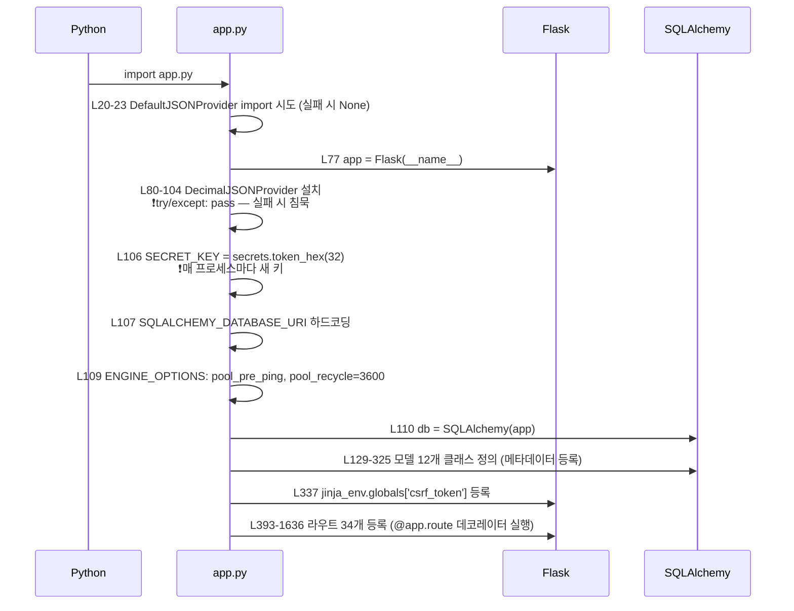
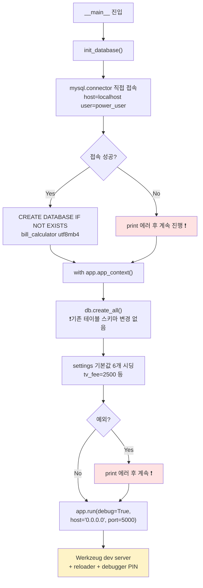
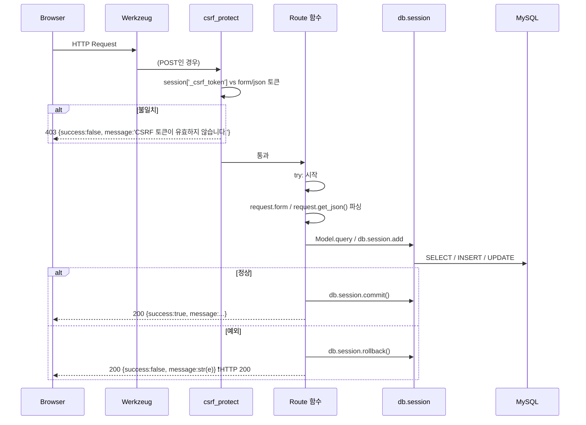
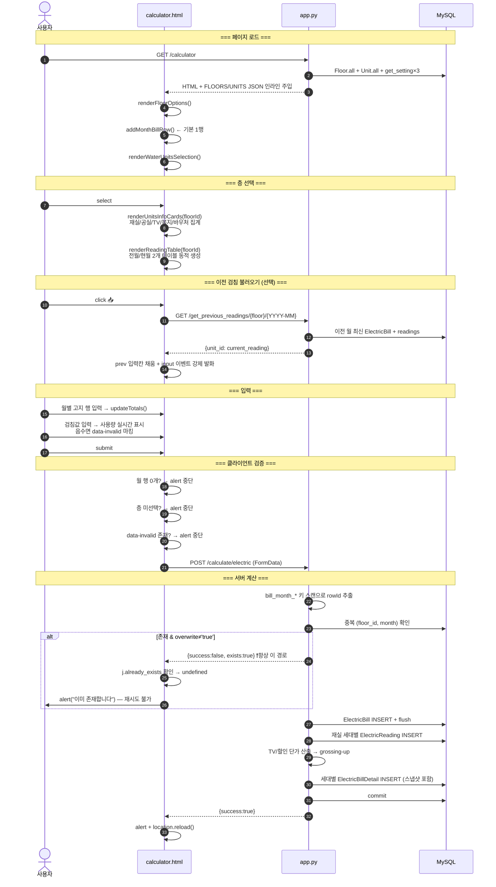
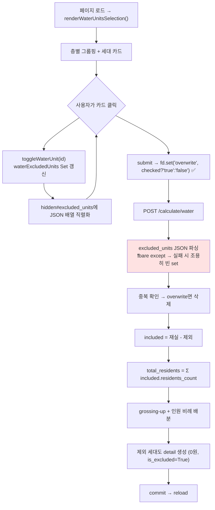
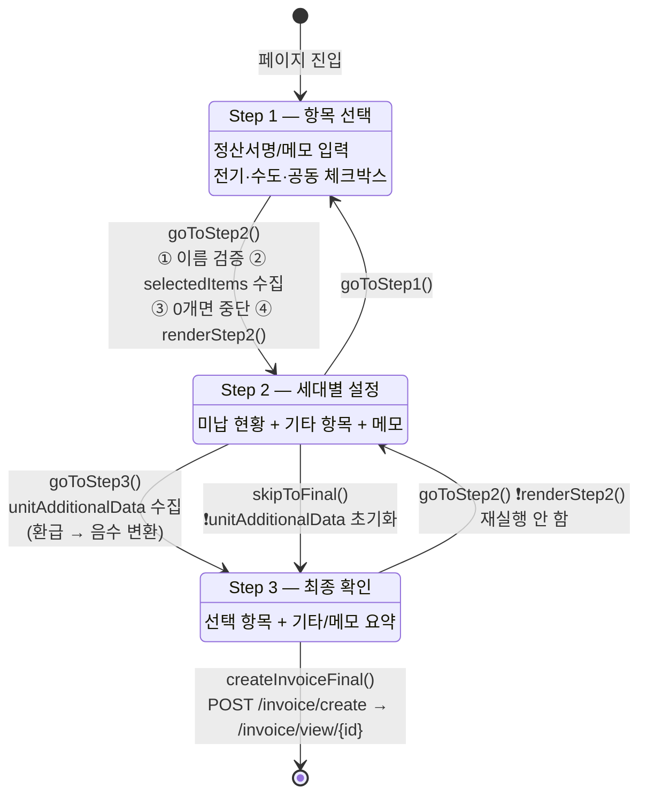
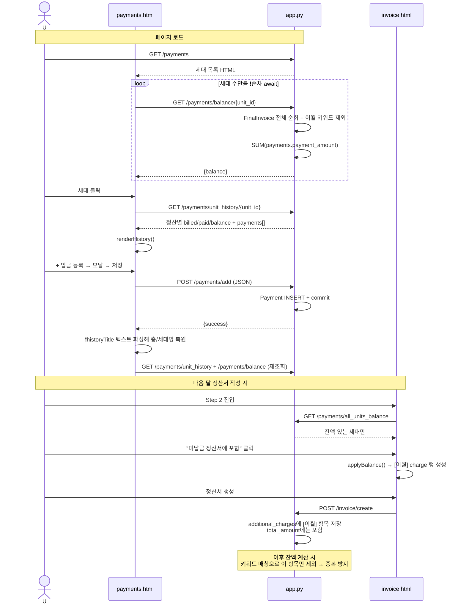

# 03. Runtime Flow

애플리케이션 실행부터 주요 기능 수행, 종료까지의 제어 흐름을 실제 호출 경로를 따라 재구성한다.

---

## 1. Application Startup

### 1.1 모듈 임포트 시점 (side-effect가 많다)

**[확인된 사실]** `import app` 만으로도 다음이 실행된다:



**중요**: `app.run()`과 DB 초기화는 `if __name__ == '__main__':` 안에만 있다(`app.py:1642`).
→ **gunicorn/uWSGI로 배포하면 `init_database()`, `db.create_all()`, 설정 시딩이 전혀 실행되지 않는다.**

### 1.2 `python app.py` 직접 실행 시

**[확인된 사실]** — `app.py:1642-1662`



**[확인된 사실] 부트스트랩의 3가지 위험**

1. `db.create_all()`은 **존재하지 않는 테이블만 만든다.** 컬럼 추가/변경은 하지 않으므로, 모델에 컬럼을 추가하면 수동 `ALTER TABLE`이 필요하다. 실제로 `SQLSchema.txt:268-342`에 그런 수동 마이그레이션 SQL이 누적되어 있다(`tv_units_count`, `monthly_details`, `is_excluded`).
2. `init_database()` 실패해도 **계속 진행**한다. 이후 첫 쿼리에서 알 수 없는 에러로 터진다.
3. `debug=True` + `host='0.0.0.0'` → **Werkzeug 디버거가 네트워크에 노출**된다. PIN 보호가 있지만 우회 사례가 알려져 있다. 개발 편의를 위한 설정이 운영 실행 코드에 그대로 있다.

---

## 2. 요청 처리 공통 흐름



**[확인된 사실]** `before_request` / `after_request` / `teardown_request` 훅은 **하나도 없다**. 요청 로깅, 트랜잭션 자동 관리, 인증 검사 지점이 없다.

**[확인된 사실]** 클라이언트는 예외 없이 `location.reload()`로 화면을 갱신한다(총 14곳). SPA적 상태 갱신은 존재하지 않는다.

---

## 3. 주요 사용자 Workflow

### 3.1 전기요금 계산 (가장 복잡한 흐름)



**Trigger → Input → Processing → Dependency → State Change → Output → Failure Case**

| 단계 | 내용 |
|---|---|
| **Trigger** | `electricForm` submit |
| **Input** | `billing_month`, `floor_id`, `tv_distribution_mode`, `month_count`, `bill_month_N`/`bill_amount_N`/`bill_welfare_N`/`bill_voucher_N`/`bill_tv_fee_N` × N, `prev_{unit_id}`/`curr_{unit_id}` × M, `overwrite` |
| **Processing** | 동적 rowId 스캔 → 합계 → 중복 검사 → 검침 저장 → TV·할인 단가 산출 → grossing-up → 사용량 비례 배분 → 음수 clamp → 10원 올림 |
| **Dependency** | `settings.tv_fee`, `settings.electric_welfare_amount`, `settings.electric_voucher_amount`, `floors`, `units` |
| **State Change** | `electric_bills` +1, `electric_readings` +M, `electric_bill_details` +M. 덮어쓰기 시 기존 3종 cascade 삭제 |
| **Output** | `{success, message}` → alert → reload |
| **Failure Case** | ① 중복 존재 → **항상 거부** (덮어쓰기 파손)<br/>② `total_usage=0` → 균등 분할로 조용히 fallback (`app.py:827`)<br/>③ 세대 0개 → `base_amount=0`, 무의미한 bill 생성<br/>④ 검침 미입력 → `dec(None)=0` → 사용량 0 → 배분 0원<br/>⑤ 예외 → rollback + `str(e)` alert |

**[확인된 사실] `zip(units, readings)` 의존성**: `app.py:824`는 `units` 리스트와 `readings` 리스트가 **같은 순서**임에 의존한다. 두 리스트는 같은 루프에서 append되므로 현재는 안전하지만, 구조적으로 취약한 결합이다.

### 3.2 수도요금 계산



**Failure Case**: `excluded_units` 파싱 실패 시 **제외 지정이 전부 무시되고 성공 응답**이 나간다. 사용자는 잘못된 청구서를 발행하게 된다.

### 3.3 정산서 생성 (3-step 위저드)



**[확인된 사실] Step2 진입 시 비동기 잔액 조회**: `renderStep2()`는 `async` 함수로 `/payments/all_units_balance`를 await한 뒤 테이블을 렌더한다(`invoice.html:854-1006`). 그런데 호출부 `goToStep2()`는 **await하지 않는다**(`invoice.html:850-851`):
```javascript
renderStep2();              // ← await 없음
updateStepIndicators(2);
```
→ 잔액 fetch가 느리면 **빈 컨테이너 상태로 Step2가 먼저 표시**된다. 로딩 인디케이터도 없다.

**[확인된 사실] Step3 → Step2 복귀 시 상태 유실**: `goToStep2()`가 `renderStep2()`를 다시 호출하므로 **입력했던 기타 항목/메모가 전부 초기화**된다. `unitAdditionalData`에 값이 남아 있어도 DOM 재생성 시 복원하지 않는다.

**[확인된 사실] `skipToFinal()`의 파괴적 동작**: `unitAdditionalData = {}`로 리셋한다(`invoice.html:1272`). 사용자가 Step2에서 입력을 다 해놓고 "기타금액 없이 바로 생성"을 누르면 **경고 없이 전부 버려진다.**

### 3.4 납부 등록 → 잔액 → 이월 순환



---

## 4. State Change 지도

### 4.1 서버 측 상태 변경 지점 [확인된 사실]

| 테이블 | INSERT | UPDATE | DELETE |
|---|---|---|---|
| `floors` | `add_floor`, `import_settings` | `update_floor` | `delete_floor`, `import_settings` |
| `units` | `add_unit`, `import_settings` | `update_unit` | `delete_unit`, (floor cascade) |
| `settings` | `set_setting`, `__main__` 시딩 | `set_setting` | 없음 |
| `electric_bills` | `calculate_electric` | `calculate_electric`(집계 갱신 853-854행) | `calculate_electric`(overwrite), `delete_bill` |
| `electric_readings` | `calculate_electric` | 없음 | (bill cascade) |
| `electric_bill_details` | `calculate_electric` | 없음 | (bill cascade) |
| `water_bills` / `_details` | `calculate_water` | `calculate_water`(959행) | `calculate_water`(overwrite), `delete_bill` |
| `common_bills` / `_details` | `calculate_common` | 없음 | `delete_bill` |
| `invoice_combinations` | `create_invoice` | 없음 | `delete_invoice` |
| `invoice_combination_items` | `create_invoice` | 없음 | (combination cascade) |
| `final_invoices` | `create_invoice` | **없음 — 수정 불가** | (combination cascade) |
| `payments` | `add_payment` | `update_payment` | `delete_payment` |

**[확인된 사실] `final_invoices`에 UPDATE 경로가 없다.** 생성된 정산서는 수정할 수 없고 삭제 후 재생성만 가능하다. 삭제하면 연결된 `payments`도 영향받는다.

### 4.2 클라이언트 측 상태 [확인된 사실]

| 상태 | 저장 위치 | 생명주기 | 리스크 |
|---|---|---|---|
| 선택된 층 | `<select>` DOM 값 | 페이지 로드까지 | reload 시 소실 |
| 월별 고지 행 | DOM `<tr>` + `monthRowCounter` | 페이지 로드까지 | 저장 실패 시 입력 유지되나 reload되면 소실 |
| 수도 제외 세대 | `waterExcludedUnits` Set + hidden input | 페이지 로드까지 | 매월 다시 선택 필요 |
| 위저드 선택 항목 | `selectedItems` 배열 | 페이지 로드까지 | Step 이동 시 유지, reload 시 소실 |
| 세대별 기타/메모 | DOM + `unitAdditionalData` | Step 전환마다 재수집 | Step3→Step2 복귀 시 **소실** |
| 이월 적용 여부 | **DOM `data-*` 속성** | DOM 수명 | 문자열 파싱으로 복원 — 취약 |
| 선택 세대 | `currentUnitId` + `historyTitle` 텍스트 | 페이지 로드까지 | 텍스트 파싱 의존 |
| Chart 인스턴스 | `electricChart`, `waterChart` | 페이지 로드까지 | - |

**세션 상태**는 `_csrf_token` 하나뿐이다(`app.py:333`). 사용자 설정·최근 선택·필터 등 어떤 것도 세션에 저장되지 않는다.

---

## 5. 종료 처리

**[확인된 사실] 명시적 종료 처리가 없다.**

- `atexit` 훅 없음
- `teardown_appcontext` / `teardown_request` 없음
- 시그널 핸들러 없음
- DB 커넥션 풀 정리는 SQLAlchemy 기본 동작에 위임
- 진행 중 트랜잭션은 프로세스 종료 시 롤백 (MySQL 측 처리)

**[강한 추론]** 단일 사용자 개발 서버 실행 전제라 Ctrl+C로 종료한다. `debug=True`의 reloader가 코드 변경 시 프로세스를 재시작하는데, 이때 `SECRET_KEY`가 새로 생성되어(`app.py:106`) **열려 있던 모든 브라우저 탭의 CSRF 토큰이 무효화**된다. 개발 중 "CSRF 토큰이 유효하지 않습니다" 에러의 원인이다.

---

## 6. 실패 모드 요약

| # | 실패 | 발생 조건 | 현재 동작 | 사용자 인지 가능? |
|---|---|---|---|---|
| 1 | 공동 공과금 0원 저장 | 항상 | 성공 메시지 표시 | ❌ 조회 페이지에서 0원을 봐야 앎 |
| 2 | 전기 덮어쓰기 거부 | 동일 (층, 월) 재계산 | "이미 존재합니다" alert | ✅ 단, 해결 방법 안내 없음 |
| 3 | 수도 제외 세대 무시 | `excluded_units` JSON 파싱 실패 | 전 세대 정산 + 성공 응답 | ❌ |
| 4 | 잔액에서 정상 항목 제외 | 기타 항목명에 '미납/환급/이월/초과납부' 포함 | 조용히 제외 | ❌ |
| 5 | 계산 삭제 실패 | 정산서에 포함된 bill 삭제 시도 | 원시 SQL 에러 문자열 alert | ⚠️ 의미 불명 |
| 6 | Import 실패/데이터 소실 | 설정 Import 실행 | FK 정책에 따라 실패 or 전체 삭제 | ⚠️ |
| 7 | JSON 파싱 에러 | `get_or_404` 경로 (없는 ID) | `res.json()` 예외 → catch 없으면 무반응 | ❌ |
| 8 | Decimal 직렬화 파손 | JSON Provider 설치 실패 | `except: pass`로 침묵 | ❌ |
| 9 | 차트 미표시 | 오프라인 / CDN 차단 | `Chart is not defined` → 이후 JS 중단 | ⚠️ 목록도 함께 안 보일 수 있음 |
| 10 | 위저드 입력 소실 | Step3→Step2 복귀, skipToFinal | 경고 없이 초기화 | ❌ |
