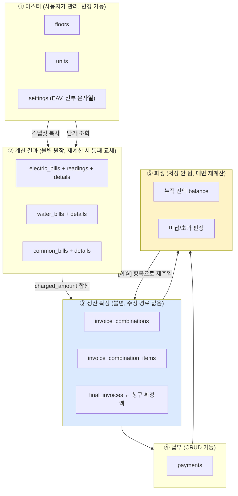
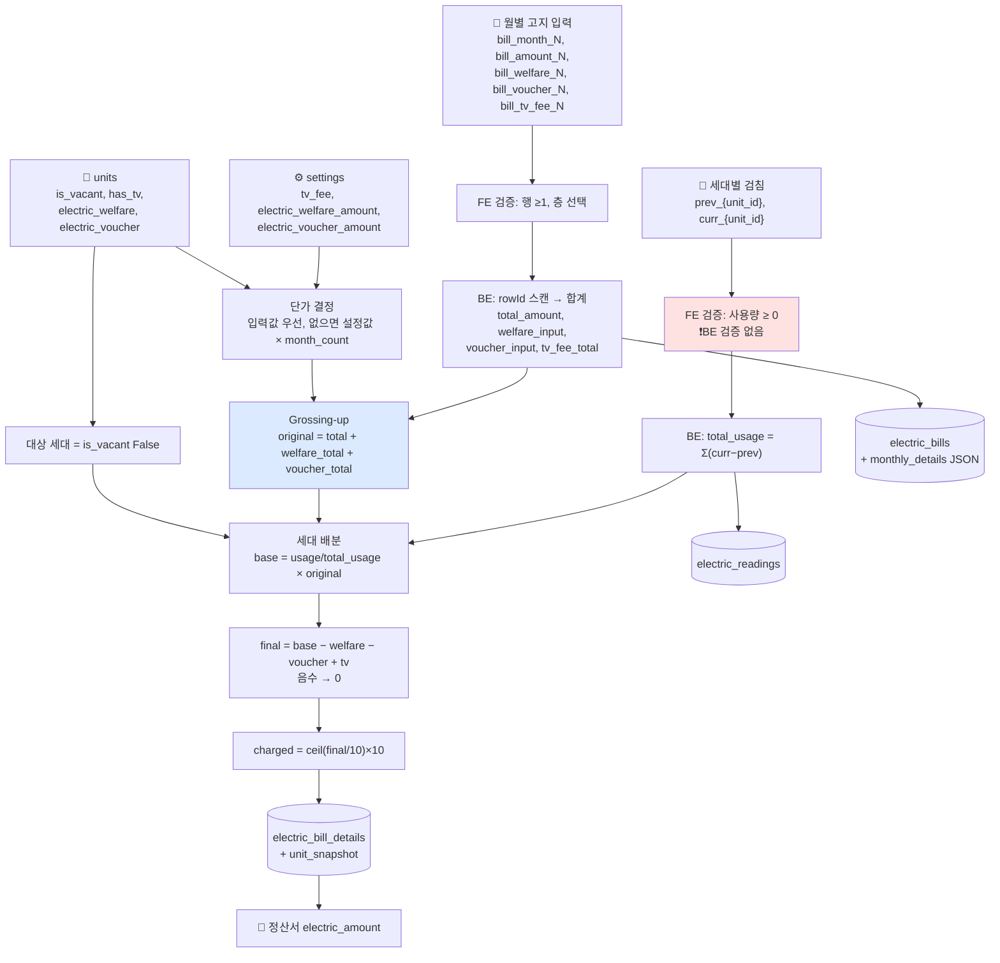
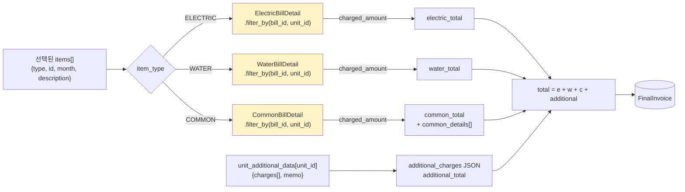
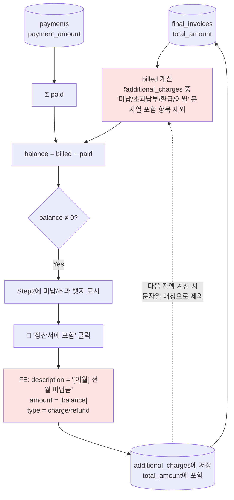

# 04. 데이터 구조 및 데이터 흐름

---

## 1. 도메인 데이터 분류



**핵심 특성 [확인된 사실]**

- ② 계산 결과는 **스냅샷 원장**이다. 마스터가 나중에 바뀌어도 과거 금액은 불변이다.
- ③ 정산 확정은 ②의 `charged_amount`를 **값으로 복사**한다. ②를 삭제해도 ③의 금액은 남는다.
- ⑤ 잔액은 **어디에도 저장되지 않고 요청마다 전체 이력을 순회해 재계산**된다. 캐시·집계 테이블 없음.

---

## 2. 엔티티 상세

### 2.1 마스터

| 엔티티 | 생성 | 변경 | 저장 | 읽기 | 생명주기 | Owner |
|---|---|---|---|---|---|---|
| `Floor` | `add_floor`, `import_settings` | `update_floor` | `floors` | 계산기/설정/조회 전반 | 영구 (수동 삭제 시까지) | 사용자 |
| `Unit` | `add_unit`, `import_settings` | `update_unit` | `units` | 모든 계산의 대상 | 영구 | 사용자 |
| `Setting` | `set_setting`, `__main__` 시딩 | `set_setting` | `settings` | `get_setting` | 영구 | 사용자 |

**[확인된 사실] `Setting`은 EAV(Entity-Attribute-Value) 안티패턴이다.**
- 모든 값이 `VARCHAR(255)` 문자열 (`app.py:160`)
- 타입 검증 없음. `set_setting(key, str(value))` (`app.py:368,370`)
- 읽을 때마다 `dec(get_setting('tv_fee','2500') or '2500')` 처럼 매번 변환 (`app.py:792`)
- 알려진 키 9개가 코드 5곳에 하드코딩 (`app.py:410-420, 429-438, 453-462, 495-504, 1648-1653`) — **키 하나 추가 시 5곳을 고쳐야 한다**
- 캐시 없음: `get_setting` 호출마다 `SELECT` 1회

### 2.2 계산 결과 (전기)

```
ElectricBill                                   ← 층·정산월 단위 헤더
├─ billing_month  DATE (항상 1일)               ← 정산월 (고지월과 다를 수 있음)
├─ floor_id
├─ total_amount   NUMERIC(12,2)                ← Σ monthly_details[].amount (TV수신료 제외)
├─ welfare_discount / voucher_discount          ← 실제 적용된 할인 총액 (계산 후 역기입, app.py:853-854)
├─ tv_fee_total                                 ← Σ monthly_details[].tv_fee
├─ tv_distribution_mode  'INDIVIDUAL'|'EQUAL'
├─ tv_units_count        ← 항상 0 (데드 컬럼)
├─ billing_months_count  ← len(monthly_details)
└─ monthly_details  JSON [{month, amount, welfare, voucher, tv_fee}]  ← 고지월별 원본

ElectricReading   (bill × unit)                ← 검침 원본
├─ previous_reading / current_reading  NUMERIC(10,2)

ElectricBillDetail (bill × unit)               ← 세대별 계산 결과
├─ usage_amount    = curr - prev
├─ base_amount     = (usage/total_usage) × original_amount
├─ welfare_discount / voucher_discount / tv_fee
├─ final_amount    = base - welfare - voucher + tv  (음수 clamp)
├─ charged_amount  = ceil(final/10)×10          ← ★ 정산서가 참조하는 확정액
└─ unit_snapshot   JSON                         ← 계산 시점 세대 속성 박제
```

**[확인된 사실] `billing_month` vs `monthly_details[].month` 의 이중 의미**
- `billing_month`: 사용자가 "이 정산을 몇 월 정산으로 볼 것인가"로 지정한 값 (`app.py:720`)
- `monthly_details[].month`: 실제 한전 고지서에 찍힌 월
- 두 값은 독립적이며 일치하지 않을 수 있다. UI는 이를 "정산월" / "고지월"로 구분해 표시한다(`invoice.html:520-521`, `view.html:415-416`).
- 이 구분은 **N개월 밀린 고지서를 한 번에 처리**하기 위한 실무적 필요에서 나온 설계다.

**[확인된 사실] `monthly_details[].month` 타입 불안정**: `invoice_view.html:157`에 `` 분기가 존재한다. 현재 코드는 항상 문자열(`<input type="month">` 값 `"YYYY-MM"`)을 저장하지만(`app.py:741`), 템플릿은 `date` 객체 가능성도 처리한다. **과거 데이터에 두 형식이 섞여 있음을 시사한다** [강한 추론]. `view.html:205`의 `detail.month.substring(0,7)`은 문자열만 가정하므로, `date` 형식 레코드가 있으면 차트가 깨진다.

### 2.3 정산 확정

```
InvoiceCombination
├─ invoice_name
└─ memo            ← default_memo + "\n\n" + user_memo

InvoiceCombinationItem
├─ item_type       'ELECTRIC'|'WATER'|'COMMON'  (String(20), ENUM 아님)
├─ billing_month
├─ item_description
└─ electric_bill_id / water_bill_id / common_bill_id  ← 3개 중 1개만 non-null ❗

FinalInvoice   (combination × unit)
├─ electric_amount / water_amount / common_amount     ← charged_amount 합산 결과
├─ common_details      JSON [{description, amount}]
├─ additional_charges  JSON [{description, amount}]   ← type/is_carryover는 버려짐
├─ total_amount        ← 위 전부의 합 (이월 포함)
├─ memo                ← combination.memo 중복 저장 (데드)
└─ unit_memo           ← 세대별 개별 안내
```

**[확인된 사실] `InvoiceCombinationItem`은 다형 참조를 3개 nullable FK로 구현한다** (`app.py:285-287`). `item_type`과 실제 채워진 FK의 정합성을 보장하는 제약(CHECK)이 없다. 셋 다 NULL이거나 둘 이상 채워진 레코드가 만들어져도 DB가 막지 못한다.

### 2.4 파생 데이터: 잔액

**[확인된 사실] 저장되지 않는다.** 요청마다 다음을 수행한다:

```
balance(unit) = Σ_모든정산( 전기 + 수도 + 공동 + Σ_이월아닌_기타항목 )
              − Σ_모든납부( payment_amount )
```

세대 하나의 잔액을 구하는 데 그 세대의 **전 기간 정산 이력 전체**를 읽는다. 정산이 24건 쌓이면 24개 레코드 순회 + JSON 파싱. 세대 30개면 페이지 로드 시 **30 × 24 = 720 레코드 순회**가 순차 HTTP 요청 30회에 나뉘어 일어난다.

---

## 3. 주요 데이터 흐름 다이어그램

### 3.1 전기요금: 입력 → 청구액



### 3.2 정산서 생성: 계산결과 → 청구 확정



노란색 3개는 **세대 × 항목 만큼 반복되는 개별 쿼리**다 (N+1, `app.py:1225-1239`).

### 3.3 잔액 순환 (이월 루프)



**이 루프의 정합성은 오직 문자열 규약에 의존한다.** FE가 만든 `'[이월] 전월 미납금'` 이라는 문자열을 BE가 `'이월' in desc` 로 되읽는 것이 유일한 연결고리다.

---

## 4. Serialization 형식

| 경계 | 형식 | 근거 |
|---|---|---|
| Browser → Flask (계산기, 설정) | `multipart/form-data` (FormData) | `calculator.html:900`, `settings.html:563` |
| Browser → Flask (정산, 납부) | `application/json` | `invoice.html:1289-1295`, `payments.html:512-516` |
| Flask → Browser (페이지) | HTML (Jinja) | 전 페이지 |
| Flask → Browser (데이터 주입) | `{{ x\|tojson }}` 로 `<script>` 안에 인라인 | `calculator.html:275`, `view.html:166`, `invoice.html:768` |
| Flask → Browser (API) | JSON (Decimal → float via 커스텀 Provider) | `app.py:83-90` |
| DB 내부 | MySQL `JSON` 컬럼 | `monthly_details`, `unit_snapshot`, `common_details`, `additional_charges` |
| Export 파일 | JSON (수동 다운로드) | `settings.html:646-657` |

**[확인된 사실] 두 가지 요청 형식이 혼재**하며, `csrf_protect`는 양쪽 모두 지원한다(`app.py:345`).

**[확인된 사실] 금액 타입 변환 경로가 길다**:
```
HTML input (문자열) → FormData → request.form (문자열)
  → dec() → Decimal → NUMERIC(10,2) [MySQL 반올림]
  → SQLAlchemy Decimal → float(JSON Provider) → JS Number
  → toLocaleString() 표시
```
`Decimal → float` 변환이 JSON 응답 경계에서 매번 일어난다. 원 단위 금액이라 실질 오차는 없지만, 타입 안전성은 경계마다 소실된다.

---

## 5. ⚠️ 잔액 계산 로직 4중 중복

**[확인된 사실]** 동일한 개념의 계산이 4곳에 각기 다른 형태로 존재한다.

| # | 위치 | 함수 | 수치 타입 | 구조 | 부가 |
|---|---|---|---|---|---|
| 1 | `app.py:1396-1409` | `payment_unit_history` | **float** | 정산 **건별** billed 산출 | - |
| 2 | `app.py:1447-1467` | `payment_balance` | Decimal → float | 세대 **누적** | - |
| 3 | `app.py:1551-1571` | `all_units_balance` | Decimal → float | 세대 **누적** (전 세대 루프) | balance≠0만 반환 |
| 4 | `app.py:1596-1621` | `validate_balances` | Decimal → float | 세대 **누적** | `carryover_total` 별도 집계 |

**공통 키워드 리스트 `['미납', '초과납부', '환급', '이월']` 가 4곳에 하드코딩되어 있다** (`app.py:1405, 1457, 1561, 1611`).

**차이점**:
- #1만 `float` 연산이고 나머지는 `Decimal`. 결과값은 실질 동일하나 타입 일관성이 깨져 있다.
- #1은 `charge.get('amount', 0)` 을 그대로 더하고, #2·#3은 `dec(charge.get('amount', 0))` 으로 감싼다.
- #4만 제외 항목을 버리지 않고 `carryover_total`로 집계한다.

**리스크**: 이월 판정 규칙을 바꾸려면 4곳을 동시에 고쳐야 한다. 하나라도 놓치면 화면마다 다른 잔액이 표시되고, **사용자는 어느 값이 맞는지 알 수 없다.** 실제로 `/admin/validate_balances`가 존재한다는 사실 자체가 **과거에 이 값들이 어긋난 적이 있음**을 시사한다 [강한 추론 — 커밋 `3aac175 "납부내역 미납금 누적 계산되는 문제 해결"` 이 이를 뒷받침].

---

## 6. 데이터 정합성 위험 목록

| # | 위험 | 근거 | 영향 |
|---|---|---|---|
| 1 | **이월 판정이 문자열 매칭** | `app.py:1405` 외 3곳 | 정상 항목이 잔액에서 누락 → 미납 추적 오류 |
| 2 | **10원 올림 오차 미보정** | `app.py:842,944,989,996` | Σ(세대 청구액) > 고지 총액. 차액이 어디로 가는지 기록 없음 |
| 3 | **`total_usage=0` 시 무음 fallback** | `app.py:827` | 검침 전부 미입력이어도 균등 분할로 저장되고 성공 응답 |
| 4 | **음수 사용량 BE 미검증** | FE에만 존재 (`calculator.html:894`) | API 직접 호출 / JS 우회 시 음수 배분 발생 |
| 5 | **`item_type`과 FK 정합성 무보장** | `app.py:1207-1212` | 잘못된 조합 저장 가능 |
| 6 | **`final_invoices` 수정 불가** | UPDATE 경로 없음 | 오타 하나에도 삭제 후 재생성 → payments 영향 |
| 7 | **스냅샷과 현재 마스터 불일치 표시** | `view_*_detail.html`은 스냅샷, `invoice_view.html:207`은 현재 `unit.unit_name` | 세대명 변경 시 화면마다 다른 이름 표시 |
| 8 | **`monthly_details.month` 타입 혼재** | `invoice_view.html:157` 분기 | 차트/표시 파손 가능 |
| 9 | **`excluded_units` 파싱 실패 무음** | `app.py:874-876` bare except | 제외 세대가 조용히 정산 대상에 포함 |
| 10 | **Import가 id를 보존하지 않음** | `app.py:506-526` | 복원 후 과거 계산의 `unit_id` 참조 불능 |
| 11 | **`Decimal` 나눗셈 정밀도** | `app.py:803,813,827,906,934,987,994` | 기본 컨텍스트 28자리 → `NUMERIC(10,2)` 저장 시 반올림. 합계와 개별값의 미세 불일치 가능 |

---

## 7. 데이터 볼륨 전망 [강한 추론]

30세대 / 3층 / 24개월 운영 가정:

| 테이블 | 예상 행 수 |
|---|---|
| `floors` / `units` / `settings` | 3 / 30 / 9 |
| `electric_bills` | 3층 × 24월 = 72 |
| `electric_readings` / `electric_bill_details` | 72 × 10세대 = 720 각각 |
| `water_bills` / `water_bill_details` | 24 / 24 × 30 = 720 |
| `common_bills` / `common_bill_details` | ~48 / 1,440 |
| `invoice_combinations` / `final_invoices` | 24 / 720 |
| `payments` | ~720 |
| **합계** | **약 5,000행** |

절대량은 작다. 문제는 볼륨이 아니라 **접근 패턴**이다:
- `/view` 는 매 로드마다 전체 `electric_bill_details` 720행을 JSON 직렬화해 HTML에 인라인
- `/payments` 는 세대당 1회 × 30회 순차 HTTP 요청, 각각 전체 정산 이력 순회
- `/invoice/create` 는 세대 × 항목 = 150회 개별 쿼리

인덱스는 `SQLSchema.txt`에 정의되어 있으나 `db.create_all()`로 만든 DB에는 **모델에 선언된 인덱스가 없다**(`db.Column(index=True)` 미사용). FK 컬럼에 MySQL이 자동 생성하는 인덱스만 존재한다 [강한 추론].
