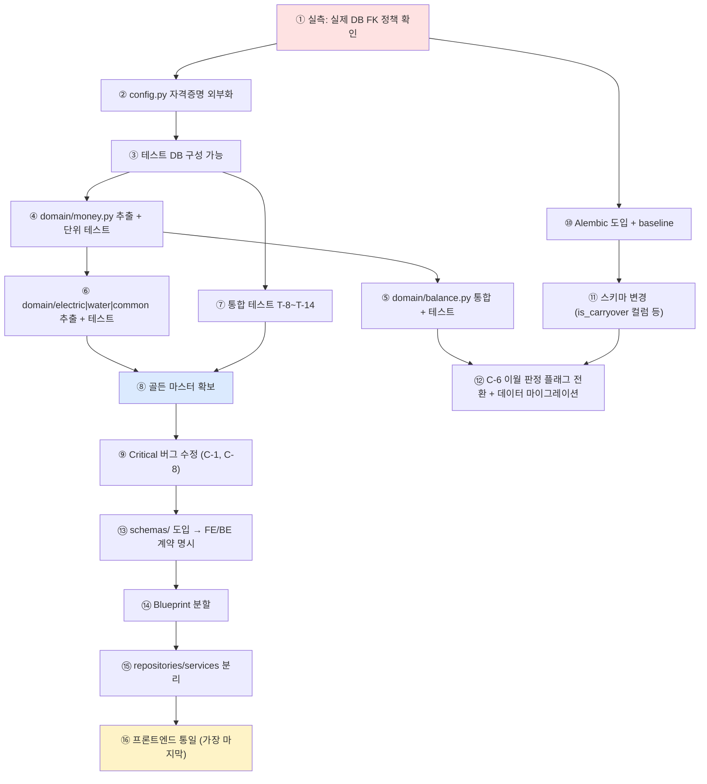

# 07. 리팩토링 기반 분석 (Baseline)

이 문서는 **"무엇을 바꿀 것인가"가 아니라 "무엇을 절대 바꾸면 안 되는가"** 를 먼저 정의한다.
대규모 리팩토링의 성공 기준은 새 구조의 우아함이 아니라, **정산 금액이 한 원도 달라지지 않는 것**이다.

---

## 1. 반드시 유지해야 할 현재 동작 (Behavioral Contract)

아래는 **코드로 확인된 현재 동작**이며, 리팩토링 후에도 동일한 입력에 동일한 출력을 내야 한다.

### B-1. 전기요금 배분 규칙 ★최우선

**출처**: `app.py:792-851`

```
전제: units = 해당 층의 is_vacant=False 세대
      total_usage = Σ(curr − prev)      ※ 음수 사용량도 그대로 합산됨

1) TV 수신료
   EQUAL      : tv_per_unit = tv_fee_total / len(units)     ← 모든 재실 세대
   INDIVIDUAL : tv_per_unit = setting(tv_fee) × month_count ← has_tv 세대만

2) 복지 할인 (바우처도 동일 구조)
   welfare_input > 0 AND welfare_units 존재
       → per_unit = welfare_input / len(welfare_units)
       → total    = welfare_input
   welfare_units 만 존재
       → per_unit = setting(electric_welfare_amount) × month_count
       → total    = per_unit × len(welfare_units)
   그 외 → per_unit = 0, total = 0

3) Grossing-up
   original = total_amount + welfare_total + voucher_total

4) 세대별
   base  = total_usage > 0 ? (usage / total_usage) × original
                           : (units 있으면 original / len(units), 없으면 0)
   final = base − (해당세대 welfare) − (해당세대 voucher) + (해당세대 tv)
   final < 0  → final = 0
   charged = ceil(final / 10) × 10        ※ float 연산 (round_up_to_10)

5) 계산 후 헤더 갱신
   bill.welfare_discount = welfare_total
   bill.voucher_discount = voucher_total
```

**보존 필수 세부사항**:
- `total_usage == 0` 시 **균등 분할 fallback** (`app.py:827`) — 조용하지만 현재 동작이다
- 음수 clamp는 **세대별 final 단계**에서만 (base는 음수 가능)
- `round_up_to_10` 은 `math.ceil(float(amount)/10)*10` — **Decimal이 아닌 float 연산** (`app.py:357`)
- 할인 입력값이 0이면 설정값 fallback, 둘 다 없으면 0

### B-2. 수도요금 배분 규칙

**출처**: `app.py:894-959`

```
included = 재실 세대 − excluded_unit_ids
total_residents = Σ included.residents_count
welfare_units   = included ∩ water_welfare

per_unit = welfare_input > 0 ? welfare_input / len(welfare_units)
                             : setting(water_welfare_amount)   ← ★ month_count 곱하지 않음
original = total_amount + welfare_total

제외 세대 → base=0, welfare=0, final=0, charged=0, is_excluded=True  (레코드는 생성됨)
포함 세대 → base = total_residents>0 ? (residents/total_residents)×original
                                     : (included 있으면 original/len(included), 없으면 0)
           final = max(base − welfare, 0)
           charged = ceil(final/10)×10
```

**보존 필수**: **제외 세대도 detail 레코드를 남긴다.** 조회 화면이 "제외됨" 뱃지를 표시하는 근거다.

### B-3. 공동 공과금 배분 규칙 (BE 로직)

**출처**: `app.py:984-999`

```
units = 전체 재실 세대
BY_RESIDENTS : amount = total_residents>0 ? (residents/total_residents)×total
                                          : (units 있으면 total/len(units), 없으면 0)
BY_UNITS     : amount = total / len(units)
charged = ceil(amount/10)×10
```

⚠️ **주의**: 현재 FE가 총액을 보내지 않아 `total=0` 이므로(C-1) 이 로직은 실질 미검증 상태다. **수정 시 "현재 동작 보존"이 아니라 "원래 의도 복원"이 목표**임을 명확히 해야 한다. 초기 커밋(`542ddac`)의 FE 폼이 원래 계약이다.

### B-4. 스냅샷 불변성 ★설계 자산

**출처**: `app.py:374-383` + 3개 detail 테이블

계산 시점의 세대 속성(`unit_name, electric_welfare, electric_voucher, has_tv, water_welfare, residents_count, is_vacant`)이 `unit_snapshot` JSON으로 박제된다. **세대 마스터를 나중에 바꿔도 과거 정산 내역은 불변이다.**

이는 이 코드베이스에서 가장 잘 설계된 부분이며, 리팩토링 시 **더 강화해야 할 방향**이다 (현재 `invoice_view.html:207` 은 스냅샷 대신 현재 `unit.unit_name` 을 쓴다 — 오히려 수정 대상).

### B-5. 청구 확정액의 값 복사

**출처**: `app.py:1225-1239`

`FinalInvoice` 는 `*_bill_details.charged_amount` 를 **값으로 복사**한다. 원본 계산을 삭제해도 정산서 금액은 남는다. 이 성질을 유지해야 과거 청구서의 재현 가능성이 보장된다.

### B-6. 이월 항목의 이중 취급 ★가장 미묘한 규칙

**출처**: `app.py:1249-1252` (저장) + `1405,1457,1561,1611` (제외)

```
[이월] 항목은
  · final_invoices.additional_charges 에 저장된다
  · final_invoices.total_amount 에 포함된다      ← 청구서에 찍히는 금액
  · 잔액 계산 시에는 제외된다                     ← 미납액 이중계상 방지
```

**리팩토링 시 반드시 유지해야 하는 불변식**:
```
balance(unit) = Σ(전기+수도+공동 + 이월아닌_기타) − Σ(납부액)
```
판정 방식(문자열 → 플래그)은 바꿔도 되지만, **이 등식이 만들어내는 숫자는 그대로여야 한다.** 방식을 바꾸는 순간 기존 데이터의 이월 항목을 마이그레이션으로 플래그 처리해야 한다.

### B-7. 정산월 vs 고지월 구분

**출처**: `app.py:720`(정산월) vs `app.py:741`(고지월)

두 개념이 독립적이며 N개월 묶음을 지원한다. 조회·정산서·인쇄 화면이 모두 이 구분을 표시한다. **단일 월 필드로 합치면 실무 요구를 깬다.**

### B-8. 10원 단위 올림

모든 청구액은 `ceil(x/10)*10`. 결과적으로 **Σ(세대 청구액) ≥ 고지 총액** 이며, 차액은 관리자 몫으로 흡수된다. 사용자에게 명시적으로 안내되고 있다(`view_electric_detail.html:201` 등). **"정확한 배분"으로 바꾸면 실무 관행을 깬다.**

### B-9. 화면별 표시 규칙

| 화면 | 규칙 | 출처 |
|---|---|---|
| 인쇄 청구서 | **해당 세대 층의 전기요금 항목만** 표시 | `invoice_print.html:301` |
| 인쇄 청구서 | 세대당 1페이지 (`page-break-after: always`) | `invoice_print.html:282` |
| 인쇄 청구서 | 금액 0원 항목은 행 자체를 생략 | `invoice_print.html:360,367,374` |
| 정산서 조회 | 전 층 항목 표시 (필터 없음) | `invoice_view.html:144` |
| 전기 차트 | **고지월** 기준 층별 라인 (정산월 아님) | `view.html:203-213` |
| 수도 상세 | 제외 세대는 회색 + "제외됨" 뱃지 + 0원 | `view_water_detail.html:96-133` |

인쇄물은 실제 세입자에게 배부되므로 **레이아웃 변경 시 반드시 실물 출력 확인**이 필요하다.

---

## 2. 먼저 테스트로 고정해야 할 Behavior

현재 테스트가 0개이므로, **리팩토링 착수 전 characterization test(현재 동작을 그대로 박제하는 테스트)** 를 확보해야 한다. 우선순위 순:

### 우선순위 1 — 순수 계산 (DB 없이 가능하도록 먼저 함수 추출)

| # | 테스트 대상 | 케이스 |
|---|---|---|
| T-1 | 전기 배분 | 정상 3세대 / 사용량 0 전원(균등 fallback) / 사용량 음수 포함 / 복지+바우처 동시 / final 음수 clamp / TV EQUAL / TV INDIVIDUAL(has_tv 혼재) / 세대 0개 |
| T-2 | 전기 할인 단가 | 입력값 있음 / 입력값 0+설정값 / 둘 다 0 / 대상 세대 0명 / month_count 2 이상 |
| T-3 | Grossing-up | `original = total + welfare_total + voucher_total` 가 배분 기준임 |
| T-4 | 수도 배분 | 제외 세대 있음 / 전원 제외 / 인원 0 / 복지 할인 |
| T-5 | 공동 배분 | BY_RESIDENTS / BY_UNITS / 세대 0개 |
| T-6 | `round_up_to_10` | 0, 1, 10, 11, 4999.01, Decimal 입력 |
| T-7 | 잔액 계산 | 이월 항목 제외 / 정상 항목 포함 / 환급(음수) / 납부 초과 / 정산 0건 |

**T-1 ~ T-7 은 현재 코드로는 작성 불가능하다.** 계산 로직이 라우트에 묶여 있기 때문이다.
→ **따라서 첫 작업은 "동작을 바꾸지 않는 함수 추출(Extract Function)"이며, 그 자체가 리팩토링 1단계다.**

### 우선순위 2 — HTTP 통합 (Flask test_client + SQLite in-memory 또는 테스트 DB)

| # | 테스트 대상 | 검증 포인트 |
|---|---|---|
| T-8 | `POST /calculate/electric` | 저장된 detail 금액, 재요청 시 중복 거부, **overwrite=true 시 교체** (C-8 회귀 방지) |
| T-9 | `POST /calculate/water` | `is_excluded` 레코드 생성, overwrite 동작 |
| T-10 | `POST /calculate/common` | **총액이 0이 아닌 값으로 저장됨** (C-1 회귀 방지) ★ |
| T-11 | `POST /invoice/create` | `final_invoices` 금액이 `charged_amount` 합계와 일치 |
| T-12 | 잔액 4개 엔드포인트 | **동일 세대에 대해 4곳이 같은 값을 반환** (H-3 회귀 방지) ★ |
| T-13 | CSRF | 토큰 없는 POST 403 |
| T-14 | 삭제 제약 | 정산서에 포함된 bill 삭제 시 동작 명세화 |

★ 표시 2건은 **이미 발생한 버그를 직접 겨냥한 테스트**다. 최우선.

### 우선순위 3 — 골든 마스터 (Golden Master)

**가장 강력한 안전망**: 실제 운영 데이터 1개월분을 fixture로 고정하고, 리팩토링 전후의 **`final_invoices` 전체와 인쇄 HTML을 바이트 단위로 비교**한다.

```
[리팩토링 전]
  운영 DB 덤프 → 테스트 DB 복원
  → /invoice/view/N, /invoice/print/N HTML 저장
  → final_invoices 전체 SELECT 결과 CSV 저장
[리팩토링 후]
  동일 절차 → diff
```

계층 구조를 크게 바꿀 때 이것 없이는 "금액이 안 바뀌었다"를 증명할 수 없다.

---

## 3. 분리해야 할 모듈 (목표 구조 제안)

```
billcalc/
├── config.py              ← 환경변수 기반 설정 (DB URI, SECRET_KEY, debug)
├── extensions.py          ← db = SQLAlchemy()  (앱 팩토리용)
├── models/
│   ├── master.py          ← Floor, Unit, Setting
│   ├── billing.py         ← ElectricBill/Reading/Detail, WaterBill/Detail, CommonBill/Detail
│   ├── invoice.py         ← InvoiceCombination, Item, FinalInvoice
│   └── payment.py         ← Payment
├── domain/                ← ★ 순수 함수. DB/HTTP 무의존. 여기가 테스트의 핵심
│   ├── money.py           ← dec, round_up_to_10, to_int
│   ├── electric.py        ← allocate_electric(inputs) -> results
│   ├── water.py           ← allocate_water(inputs) -> results
│   ├── common.py          ← allocate_common(inputs) -> results
│   └── balance.py         ← ★ calculate_balance() — 4중 중복 통합 (H-3)
├── repositories/          ← ORM 격리
├── services/              ← 트랜잭션 경계 + 도메인 호출 + 영속화
│   ├── electric_service.py
│   ├── invoice_service.py
│   └── payment_service.py
├── schemas/               ← ★ 요청/응답 스키마 (H-4 해결)
├── web/
│   ├── __init__.py        ← create_app() 앱 팩토리
│   ├── errors.py          ← 글로벌 에러 핸들러 + 도메인 예외 매핑
│   ├── csrf.py
│   └── blueprints/        ← settings / calculator / views / invoice / payments
├── static/                ← ★ CSS/JS 분리 (M-1) + Chart.js 로컬 번들 (오프라인화)
├── templates/
└── migrations/            ← ★ Alembic (H-10, C-5)
tests/
├── unit/domain/           ← T-1 ~ T-7
├── integration/           ← T-8 ~ T-14
└── golden/                ← 골든 마스터
```

### 분리 우선순위와 근거

| 순위 | 대상 | 근거 | 위험도 |
|---|---|---|---|
| 1 | `domain/money.py` | 순수 함수, 의존 없음. 즉시 테스트 가능 | 매우 낮음 |
| 2 | `domain/balance.py` | 4중 중복 통합. **버그 수정 효과 즉시 발생** | 낮음 (테스트 선행 시) |
| 3 | `domain/electric.py` 등 | 최대 가치. 단, 입출력 DTO 설계가 선행 필요 | 중 |
| 4 | `config.py` | 자격증명 외부화. 모든 환경 분리의 전제 | 매우 낮음 |
| 5 | Blueprint 분할 | 기계적. 로직 변경 없음 | 낮음 |
| 6 | `repositories/` | ORM 격리. 쿼리 최적화(H-9) 지점 확보 | 중 |
| 7 | `schemas/` | FE/BE 계약 명시화 → C-1/C-8 재발 방지 | 중 (FE 동시 수정) |
| 8 | 프론트엔드 통일 | 가장 큼. 목표 아키텍처 결정 선행 | 높음 |

---

## 4. Abstraction이 필요한 영역

| 영역 | 현재 | 필요한 추상화 | 이유 |
|---|---|---|---|
| **배분 알고리즘** | 3개 라우트에 인라인, 구조가 유사하나 코드는 별개 | `Allocator` 인터페이스 (`allocate(total, weights, adjustments) -> per_unit[]`) | 전기(사용량)/수도(인원)/공동(인원·균등)이 **동일 패턴의 변주**다. 통합하면 신규 요금 종류 추가가 쉬워진다 |
| **금액 타입** | `Decimal` ↔ `float` ↔ `str` 이 경계마다 변환 | `Money` 값 객체 (원 단위 정수 권장) | SQLite 전환 시 `NUMERIC` 부재 문제 해결. 반올림 정책 일원화 |
| **설정 접근** | `get_setting(key, default)` — 호출마다 SELECT, 키 5곳 하드코딩 | `Settings` 객체 (스키마·타입·기본값 정의 + 요청 단위 캐시) | M-4 해결 + 쿼리 감소 |
| **이월 판정** | 문자열 키워드 매칭 4곳 | `AdditionalCharge` 값 객체에 `is_carryover: bool` | C-6 해결 |
| **응답 포맷** | 3종 혼재 | `ApiResponse` + 에러 코드 체계 | M-7, H-4 해결 |
| **DB 접근** | 라우트에서 직접 `Model.query` | Repository | 테스트 격리 + N+1 해결 지점 |
| **스냅샷** | dict 생성 함수 1개 | `UnitSnapshot` 값 객체 (버전 필드 포함) | 스키마 진화 대응 |

---

## 5. 재설계가 필요한 영역

### 5.1 프론트엔드 아키텍처 (가장 큰 결정)

현재 4가지 패러다임이 공존한다(H-5). 선택지:

| 선택지 | 장점 | 단점 | 적합성 |
|---|---|---|---|
| **(a) 서버 렌더 + HTMX/Alpine.js** | 점진적 전환 가능, 빌드 도구 불필요, 현재 Jinja 자산 유지, 오프라인 친화 | SPA 수준 인터랙션 한계 | ★ 이 앱의 규모·성격에 가장 적합 |
| (b) SPA (React/Vue) | 위저드·동적 폼에 유리 | 전면 재작성, 빌드 체인 도입, API 전면 정비 선행 | 인력·기간 여유 있을 때 |
| (c) 현행 유지 + 공통 모듈만 추출 | 최소 비용 | 근본 해결 안 됨 | 임시방편 |

**판단 근거**: 이 앱의 복잡한 인터랙션은 ① 계산기 검침 입력표 ② 정산 위저드 3-step 두 곳에 집중되어 있다. 나머지는 표와 폼이다. `TODO.md`의 Electron 구상까지 고려하면 **(a)** 가 현실적이다.

### 5.2 데이터 저장소 전략

`TODO.md:11` — "Electron + sqlite 방식도 고려중 (독립형 앱으로)"

MySQL → SQLite 전환 시 검토 항목([05-external-dependencies.md §6](05-external-dependencies.md)):
- `db.Numeric(12,2)` → SQLite에 DECIMAL 없음 → **원 단위 정수 저장으로 변경 권장**
- `db.Enum(...)` → CHECK 제약
- `db.JSON` → JSON1 확장 (파이썬 측에서만 다루므로 영향 적음)
- `mysql.connector` 직접 사용부 제거
- **선행 조건**: 도메인 계층 분리 + `Money` 추상화. 그래야 저장 타입 변경이 계산 로직에 파급되지 않는다

### 5.3 정산서 수정 기능

현재 `final_invoices` 에 UPDATE 경로가 없다. "청구서 발행 후 오타 하나 고치기"가 삭제→재생성이며, 이때 `payments` 가 영향받는다. **도메인 모델에 "발행 전 초안 / 발행 후 확정" 상태 구분이 필요**하다.

### 5.4 오류·로깅 인프라

로깅이 전무하다. 리팩토링 중 회귀를 진단하려면 **리팩토링 시작 전에** 최소한의 구조화 로깅이 필요하다.

---

## 6. 리팩토링 순서에 영향을 주는 Dependency



### 핵심 제약

| 제약 | 설명 |
|---|---|
| **①이 모든 것의 선행** | FK가 CASCADE인지 RESTRICT인지 모르면 삭제·Import 관련 어떤 변경도 안전하지 않다. **읽기 전용 쿼리 1회로 확인 가능** |
| **②→③→④ 는 직렬** | 자격증명이 하드코딩된 동안은 테스트 DB를 쓸 수 없고, 테스트 없이는 어떤 추출도 안전하지 않다 |
| **⑧ 이전에 버그 수정 금지** | 골든 마스터 없이 C-1을 고치면 "고쳐진 것"과 "망가진 것"을 구별할 수 없다. 단, C-1은 **의도적 동작 변경**이므로 골든 마스터의 기준선을 명시적으로 갱신해야 한다 |
| **⑫ 는 데이터 마이그레이션 동반** | 기존 `additional_charges` JSON의 이월 항목을 문자열 판정으로 한 번 스캔해 `is_carryover` 를 채워야 한다. **이 마이그레이션 자체가 문자열 판정의 마지막 사용처**가 된다 |
| **⑯ 은 반드시 마지막** | 프론트를 먼저 바꾸면 백엔드 계약이 유동적인 상태에서 두 번 작업하게 된다 |

---

## 7. 높은 Regression Risk 영역

리팩토링 시 **깨질 확률 × 발견 난이도** 기준.

| 순위 | 영역 | 위험 | 왜 발견이 어려운가 | 방어책 |
|---|---|---|---|---|
| 🔴 1 | **grossing-up + 할인 분기** (`app.py:799-838`) | 조건 분기 4가지(입력값/설정값/대상없음)를 하나라도 놓치면 금액이 조용히 달라진다 | 금액이 "그럴듯하게" 나온다. 고지 총액과 대조해야 발견 | T-1~T-3 + 골든 마스터 |
| 🔴 2 | **이월 항목 제외 규칙** (4곳) | 4곳 중 하나만 바꾸면 화면마다 다른 잔액 | 사용자가 여러 화면을 비교해야 발견 | T-12 (4곳 동일값 검증) |
| 🔴 3 | **`round_up_to_10` float 연산** | Decimal로 "개선"하면 경계값에서 1원 차이 발생 가능 | 대부분 케이스에서 동일 | T-6 경계값 테스트 |
| 🟠 4 | **`zip(units, readings)` 순서 의존** (`app.py:824`) | 조회 방식을 바꾸면 **세대와 검침이 어긋난 채 계산**된다 | 금액은 나오지만 세대별로 뒤바뀜 | detail의 `unit_id` ↔ 스냅샷 `unit_name` 일치 검증 |
| 🟠 5 | **`monthly_details` JSON 스키마** | 키 이름 변경 시 5개 템플릿이 조용히 깨진다 (Jinja는 없는 키를 Undefined로 처리) | 화면에 "-"만 표시되고 에러 없음 | 스키마 버전 + 템플릿 렌더 테스트 |
| 🟠 6 | **`unit_snapshot` 키 이름** | 3개 템플릿이 `unit_snapshot.residents_count` 를 직접 참조 | 위와 동일 | 값 객체화 + 렌더 테스트 |
| 🟠 7 | **인쇄 레이아웃** (`invoice_print.html`) | CSS 변경 시 페이지 분리·여백이 깨진다 | 실제 인쇄해야 발견 | 골든 마스터 HTML + 실물 출력 확인 |
| 🟡 8 | **CSRF 토큰 흐름** | Blueprint 분할 시 데코레이터 누락 | 개발 중엔 통과, 특정 경로만 무방비 | 전 POST 라우트에 대한 T-13 |
| 🟡 9 | **`is_vacant` 필터링** | `filter_by(is_vacant=False)` 가 8곳에 흩어져 있다 | 공실 세대가 청구 대상에 포함되어도 금액이 나옴 | Repository 통합 + 테스트 |
| 🟡 10 | **`billing_month` 정규화** | `replace(day=1)` 이 3곳(`app.py:720,867,972`) | 월 중간 날짜가 들어가면 중복 검사가 실패 | 값 객체 `BillingMonth` |

---

## 8. 권장 착수 순서 (실행 계획 요약)

### Phase 0 — 사실 확정 (0.5일, 코드 변경 없음)
1. **실제 DB의 FK `ON DELETE` 정책 실측** (읽기 전용 쿼리)
2. 실제 DB 스키마와 모델 정의 diff
3. `monthly_details.month` 필드에 문자열 외 타입이 있는지 실데이터 확인
4. 운영 데이터 백업 확보

### Phase 1 — 안전망 구축 (3~5일)
5. `.gitignore` 추가, 커밋된 `__pycache__` 제거, 데드 코드 제거(M-8)
6. `config.py` + `.env` 로 자격증명 외부화 (C-2)
7. `debug`/`host` 환경변수화, 기본값 안전하게 (C-3)
8. 테스트 인프라 구성 (pytest + 테스트 DB)
9. **`domain/money.py` 추출 → T-6 테스트**
10. **`domain/balance.py` 통합 → T-7, T-12 테스트** (H-3 해결 + C-6 준비)
11. 통합 테스트 T-8 ~ T-14 작성 (**현재의 잘못된 동작도 그대로 박제**)
12. 골든 마스터 확보

### Phase 2 — Critical 수정 (2~3일)
13. C-1 공동 공과금 계약 복구 (+ T-10 을 "올바른 동작"으로 갱신)
14. C-8 전기 덮어쓰기 복구 (+ T-8)
15. C-4/C-5 스키마·Import 정리 — Alembic 도입, `SQLSchema.txt` 정리
16. C-6 이월 판정 플래그 전환 + 데이터 마이그레이션
17. H-8 로깅 + 글로벌 에러 핸들러

### Phase 3 — 구조 리팩토링 (2~3주)
18. `domain/electric|water|common` 추출 (T-1~T-5 로 보호)
19. `schemas/` 도입 — FE/BE 계약 명시화
20. Blueprint 분할 → repositories → services
21. N+1 해소 (H-9)

### Phase 4 — 프론트엔드 (별도 프로젝트 규모)
22. 목표 아키텍처 결정 → `static/` 분리 → Chart.js 로컬화 → 페이지별 점진 전환

---

## 9. 성공 기준

리팩토링이 성공했는지 판단하는 **객관적 기준**:

1. ✅ **동일 입력에 대해 `final_invoices` 의 모든 금액이 리팩토링 전과 1원도 다르지 않다** (골든 마스터 통과)
2. ✅ 4개 잔액 엔드포인트가 동일 세대에 대해 **항상 같은 값**을 반환한다
3. ✅ 공동 공과금이 입력한 총액대로 저장된다
4. ✅ 동일 (층, 정산월) 전기요금을 **덮어쓰기로 재계산**할 수 있다
5. ✅ DB 자격증명이 소스에 없다
6. ✅ 도메인 계산 함수가 **DB·HTTP 없이** 단위 테스트된다
7. ✅ `git clone` 후 README만 보고 실행할 수 있다
8. ✅ 스키마 변경이 마이그레이션 파일로 관리된다

---

## 10. 마지막 경고

**[확인된 사실 기반 판단]**

이 프로젝트의 Critical 결함 중 최소 2건(C-1 공동 공과금, C-8 덮어쓰기)은 **"UI만 손보는 커밋"에서 발생했고, 테스트가 없어 발견되지 않았으며, 지금도 성공 메시지 뒤에 숨어 있다.**

대규모 리팩토링은 이보다 훨씬 광범위한 변경이다. **테스트와 골든 마스터 없이 구조를 손대면, 지금 잘못 저장되고 있는 공동 공과금처럼 "성공 메시지와 함께 조용히 잘못된 금액이 청구되는" 결함이 더 큰 규모로 재발한다.**

Phase 1(안전망)을 건너뛰고 Phase 3(구조)으로 가지 말 것. 이것이 이 분석의 가장 중요한 결론이다.
