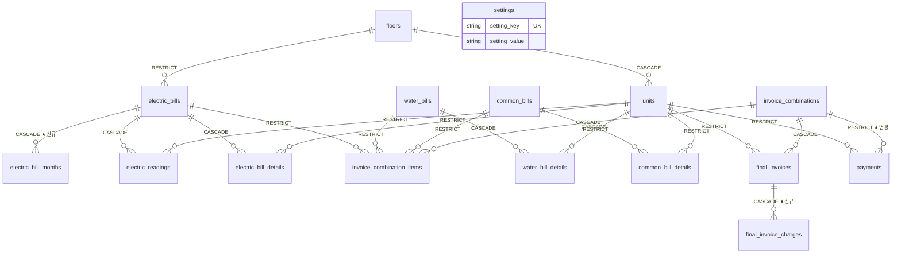

# 01. 목표 SQLite Schema

> 선행: [00-current-db-audit.md](00-current-db-audit.md)
> 새로운 Single Source of Truth = **SQLAlchemy Models (`models.py`) + Alembic migration history**

---

## 1. 설계 원칙

| # | 원칙 |
|---|---|
| P-1 | **도메인 계산 결과를 바꾸지 않는다.** 저장 표현만 바꾼다 |
| P-2 | **회계성 데이터(계산/정산/납부)는 마스터 삭제로 연쇄 삭제되지 않는다** |
| P-3 | 애플리케이션 코드로만 강제되던 규칙 중 **DB로 옮길 수 있는 것은 constraint로 옮긴다** |
| P-4 | 부동소수점으로 금액을 저장하지 않는다 |
| P-5 | 스냅샷 불변성(`unit_snapshot`)을 유지한다 |
| P-6 | 이월 여부를 **문자열이 아닌 명시적 컬럼**으로 보존한다 |
| P-7 | JSON은 "표시 전용 스냅샷"에만 쓰고, "비즈니스 집계 대상"은 관계형으로 분리한다 |

---

## 2. DB 파일 배치 및 런타임 설정

```
BillCalculator/
├── data/                        ← .gitignore 대상 (디렉터리는 .gitkeep으로 유지)
│   ├── bill_calculator.db
│   ├── bill_calculator.db-wal   ← WAL 모드 사이드카
│   ├── bill_calculator.db-shm
│   └── backups/                 ← backup_database() 출력
├── config.py                    ← 경로/URI 단일 정의
└── migrations/                  ← Alembic
```

**경로 결정 우선순위** (`config.py`):
1. 환경변수 `BILLCALC_DATABASE_URI` (전체 URI 직접 지정)
2. 환경변수 `BILLCALC_DB_PATH` (파일 경로만 지정)
3. 기본값 `<repo>/data/bill_calculator.db`

코드 어디에도 경로를 하드코딩하지 않는다.

### 2.1 PRAGMA 정책 (근거 포함)

이 앱의 특성: **단일 사용자 · Flask 로컬 서버(threaded) · 소규모 DB(~5,000행) · 동시 쓰기 거의 없음 · 다만 동시 읽기는 빈번**
(`payments.html:243-272`가 세대 수만큼 순차 요청을 보내고, Werkzeug 개발 서버는 `threaded=True`가 기본)

| PRAGMA | 값 | 근거 |
|---|---|---|
| `foreign_keys` | `ON` | SQLite는 **기본이 OFF**. 커넥션마다 설정하지 않으면 FK가 전혀 검증되지 않는다. `connect` 이벤트 훅으로 강제하고 **테스트로 검증** |
| `journal_mode` | `WAL` | 읽기가 쓰기를 막지 않는다. 위 동시 읽기 패턴에 실익이 있다. 단점(사이드카 파일 2개)은 `.gitignore`와 네이티브 backup API로 대응 |
| `synchronous` | `FULL` | 금액 데이터이므로 최신 트랜잭션 유실을 허용하지 않는다. 쓰기 빈도가 낮아 성능 비용이 무시할 수준 |
| `busy_timeout` | `5000` (ms) | threaded 서버에서 순간적 잠금 경합 시 즉시 `database is locked`로 실패하지 않도록 |

> WAL을 "일반적 best practice라서" 쓰는 것이 아니라, **이 앱의 동시 읽기 패턴 때문에** 선택했다.
> 반대로 `synchronous`는 일반적 권장값(`NORMAL`)이 아닌 `FULL`을 선택했다. 데이터 성격이 우선이다.

---

## 3. 타입 전략 — 금액 / 계량 / 비율

`db.Numeric`은 **사용하지 않는다.** SQLite에서 SQLAlchemy `Numeric`은 REAL(부동소수점) 저장으로 변환되며 경고를 발생시킨다.

| 타입 | 저장 | Python 표현 | 적용 대상 |
|---|---|---|---|
| **`Money`** | `INTEGER` (원) | `int` | 통화 금액 — 사용자 입력 총액, 할인 총액, `charged_amount`, `final_invoice` 금액, `payment_amount` |
| **`ExactDecimal(2)`** | `TEXT` (정규화 문자열 `'12345.67'`) | `Decimal` | 배분 중간값(`base_amount`, `final_amount`, 세대별 할인/TV), 계량값(`previous_reading`, `current_reading`, `usage_amount`) |
| 비율 | **저장하지 않음** | `Decimal` | 계산 시점에만 존재 |

### 3.1 `Money` (TypeDecorator → Integer)

```
bind:   None → None
        그 외 → int(Decimal(str(v)).quantize(1, ROUND_HALF_UP))
result: None → None / 그 외 → int
```

- MySQL `DECIMAL(x,2)`에 `12500.00`으로 저장되던 값이 `12500`이 된다 → **값 동일**
- 소수부가 0이 아닌 레거시 값은 **마이그레이션이 `requires-review`로 탐지**하고 임의 반올림하지 않는다
- `int`는 Python에서 `Decimal`과 자유롭게 연산되므로 기존 계산 코드가 그대로 동작한다
  (`Decimal('0') + 12500 → Decimal('12500')`)
- 템플릿의 `"{:,.0f}".format(x)` / `|int` / `|sum` 모두 `int`에서 동일하게 동작한다

### 3.2 `ExactDecimal(2)` (TypeDecorator → String)

```
bind:   None → None
        그 외 → str(Decimal(str(v)).quantize(Decimal('0.01'), ROUND_HALF_UP))
result: None → None / 그 외 → Decimal(text)
```

- MySQL `DECIMAL(x,2)`의 반올림(half away from zero)과 **동일**한 `ROUND_HALF_UP` 사용 → 값 보존
- **부동소수점을 전혀 거치지 않는다**
- TEXT 저장의 대가: SQL `ORDER BY` / `SUM()` 이 사전식이 되어 무의미해진다.
  → **감사 결과 이 컬럼들은 SQL에서 정렬·집계되지 않는다** ([00-current-db-audit.md §10](00-current-db-audit.md)). 전부 Python/Jinja 측에서 집계된다. 따라서 문제 없다.
- CHECK 제약이 필요한 경우 `CAST(col AS REAL) >= 0` 형태로 작성한다 (TEXT를 그대로 비교하면 SQLite 타입 우선순위 때문에 항상 참이 된다)

### 3.3 `round_up_to_10` 은 변경하지 않는다

```python
def round_up_to_10(amount):
    return math.ceil(float(amount) / 10) * 10
```

float 경유가 이론적으로 아쉽지만 **현재 도메인 결과를 바꾸지 않는 것이 최우선**이므로 구현을 그대로 둔다.
Money 추상화는 이 함수의 **결과를 저장하는 방식**만 담당한다.

---

## 4. ER Diagram



**읽는 법**: 화살표의 라벨은 **부모 삭제 시 자식에 적용되는 정책**이다.
`units ||--o{ payments : RESTRICT` = 납부 기록이 있는 세대는 삭제할 수 없다.

---

## 5. FK 정책 결정표 (도메인 근거)

| 부모 → 자식 | 정책 | 도메인 근거 |
|---|:---:|---|
| `floors` → `units` | **CASCADE** | 층은 세대의 구조적 컨테이너. 현재 동작(`app.py:137` delete-orphan) 보존. 회계 기록이 있는 세대는 아래 RESTRICT가 막으므로 안전 |
| `floors` → `electric_bills` | **RESTRICT** | 전기 고지는 회계 기록. 층을 지웠다고 과거 고지가 사라지면 안 됨 |
| `units` → `electric_readings` | **RESTRICT** | 검침 원본은 회계 근거 자료 |
| `units` → `electric_bill_details` | **RESTRICT** | 과거 청구 산출 근거 |
| `units` → `water_bill_details` | **RESTRICT** | 〃 |
| `units` → `common_bill_details` | **RESTRICT** | 〃 |
| `units` → `final_invoices` | **RESTRICT** | **발행된 청구서**. 절대 자동 삭제 금지 |
| `units` → `payments` | **RESTRICT** | **입금 기록**. 절대 자동 삭제 금지 |
| `electric_bills` → `electric_bill_months` | **CASCADE** | 고지월 명세는 헤더 없이 의미 없음. 재계산 시 통째 교체 |
| `electric_bills` → `electric_readings` | **CASCADE** | 〃 (현재 동작 보존, `app.py:181`) |
| `electric_bills` → `electric_bill_details` | **CASCADE** | 〃 (`app.py:182`) |
| `water_bills` → `water_bill_details` | **CASCADE** | 〃 (`app.py:222`) |
| `common_bills` → `common_bill_details` | **CASCADE** | 〃 (`app.py:249`) |
| `electric_bills` → `invoice_combination_items` | **RESTRICT** | **정산서에 포함된 계산은 삭제 불가**. 현재 de-facto 동작을 명시화 |
| `water_bills` → `invoice_combination_items` | **RESTRICT** | 〃 |
| `common_bills` → `invoice_combination_items` | **RESTRICT** | 〃 |
| `invoice_combinations` → `invoice_combination_items` | **CASCADE** | 조합 구성요소. 현재 동작 보존 (`app.py:271`) |
| `invoice_combinations` → `final_invoices` | **CASCADE** | 조합 삭제 = 청구서 취소. 현재 동작 보존 (`app.py:272`) |
| `invoice_combinations` → `payments` | **RESTRICT ★변경** | **입금 기록이 있는 정산서는 삭제 불가.** 현재는 정책이 불명확해 원시 FK 에러로 실패하거나(RESTRICT DB) 조용히 삭제될 수 있었다(CASCADE DB) → I-15 해결 |
| `final_invoices` → `final_invoice_charges` | **CASCADE** | 청구서의 구성 항목 |

### ORM 측 대응

- **CASCADE FK**: 관계에 `passive_deletes=True` → DB가 처리, SQLAlchemy가 중복 DELETE 발행하지 않음
- **RESTRICT FK**: 관계에 `passive_deletes='all'` → SQLAlchemy가 FK를 NULL로 갱신하려 시도하지 않고 **DB 제약이 그대로 발동**

### 라우트 측 대응 (사용자 경험)

RESTRICT 위반은 원시 SQL 에러 문자열 대신 **사전 검사 + 명확한 한국어 메시지**로 처리한다.
(예: "이 세대에는 정산 내역 3건, 납부 내역 5건이 있어 삭제할 수 없습니다. 공실 처리를 사용하세요.")

---

## 6. 테이블 명세

> 공통: 모든 테이블에 `id INTEGER PRIMARY KEY AUTOINCREMENT`.
> `created_at` / `updated_at` 은 `DATETIME`, Python 측 `datetime.utcnow` 기본값 (현재 동작 보존).
> `Money` = INTEGER(원), `Dec2` = TEXT(정확 Decimal, 소수 2자리).

### 6.1 `floors`

| column | type | null | default | 제약 |
|---|---|:---:|---|---|
| `floor_number` | INTEGER | ✗ | - | **UNIQUE** |
| `name` | VARCHAR(50) | ✓ | - | |
| `electric_contract_number` | VARCHAR(50) | ✓ | - | |

**변경점**: 없음 (D-1의 `electric_contract_number`를 정식 반영)

### 6.2 `units`

| column | type | null | default | 제약 |
|---|---|:---:|---|---|
| `floor_id` | INTEGER | ✗ | - | FK → `floors.id` **ON DELETE CASCADE** |
| `unit_name` | VARCHAR(50) | ✗ | - | |
| `memo` | TEXT | ✓ | - | |
| `electric_welfare` | BOOLEAN | ✗ | `0` | |
| `electric_voucher` | BOOLEAN | ✗ | `0` | |
| `has_tv` | BOOLEAN | ✗ | `1` | |
| `water_welfare` | BOOLEAN | ✗ | `0` | |
| `residents_count` | INTEGER | ✗ | `1` | **CHECK ≥ 0** (I-9) |
| `is_vacant` | BOOLEAN | ✗ | `0` | |

**UNIQUE**: `(floor_id, unit_name)` ★신규 (I-8) — Import upsert의 자연키이기도 함
**INDEX**: `(floor_id)`

**변경점**: Boolean 컬럼이 `nullable=False`로 강화됨 (현재는 NULL 가능 → `bool(None)` 분기 위험)

### 6.3 `settings`

| column | type | null | 제약 |
|---|---|:---:|---|
| `setting_key` | VARCHAR(50) | ✗ | **UNIQUE** |
| `setting_value` | TEXT | ✓ | |

**변경점**: 테이블 구조는 유지(§11 근거). `VARCHAR(255)` → `TEXT` (고정 메모/푸터가 255자를 넘을 수 있음 — 현재 잠재적 데이터 절단 버그)
**Python 측**: `settings_registry.py`에 키·타입·기본값·검증을 **단일 정의**하고, 기존 5곳 중복(§11, M-4)을 제거

### 6.4 `electric_bills`

| column | type | null | default | 제약 |
|---|---|:---:|---|---|
| `billing_month` | DATE | ✗ | - | **CHECK day=1** |
| `floor_id` | INTEGER | ✗ | - | FK → `floors.id` **ON DELETE RESTRICT** |
| `total_amount` | Money | ✗ | `0` | CHECK ≥ 0 |
| `welfare_discount` | Money | ✗ | `0` | CHECK ≥ 0 |
| `voucher_discount` | Money | ✗ | `0` | CHECK ≥ 0 |
| `tv_fee_total` | Money | ✗ | `0` | CHECK ≥ 0 |
| `tv_distribution_mode` | VARCHAR(20) | ✗ | `'INDIVIDUAL'` | **CHECK IN ('INDIVIDUAL','EQUAL')** |
| `billing_months_count` | INTEGER | ✗ | `1` | CHECK ≥ 0 |

**UNIQUE**: `(floor_id, billing_month)` ★신규 (I-4, D-11)
**INDEX**: `(billing_month)`

**변경점**:
- `tv_units_count` **삭제** (D-2: 항상 0, 읽는 곳 없음)
- `monthly_details` JSON **삭제** → `electric_bill_months` 테이블로 분리 (I-14)
- Numeric → Money

### 6.5 `electric_bill_months` ★신규 (`monthly_details` JSON 대체)

| column | type | null | default | 제약 |
|---|---|:---:|---|---|
| `electric_bill_id` | INTEGER | ✗ | - | FK → `electric_bills.id` **ON DELETE CASCADE** |
| `billing_month` | DATE | ✗ | - | **CHECK day=1** |
| `amount` | Money | ✗ | `0` | CHECK ≥ 0 |
| `welfare_discount` | Money | ✗ | `0` | CHECK ≥ 0 |
| `voucher_discount` | Money | ✗ | `0` | CHECK ≥ 0 |
| `tv_fee` | Money | ✗ | `0` | CHECK ≥ 0 |

**UNIQUE**: `(electric_bill_id, billing_month)`
**INDEX**: `(billing_month)` — 조회 페이지 차트가 고지월 기준으로 집계

**해결하는 문제**: `month` 필드의 타입 불안정(문자열 `'2025-03'` vs `date`)을 **DATE 컬럼으로 확정**한다.
정렬은 `ORDER BY billing_month`로 결정적이 되어, `months[0] ~ months[-1]` 범위 표시가 항상 올바르다.

**정렬 순서**: `sort_order` 컬럼을 두지 않는다. UNIQUE 제약으로 월 중복이 불가능하므로 `billing_month` 정렬이 전순서(total order)를 이루며, 도메인상 고지월 오름차순이 유일하게 올바른 표시 순서다.

### 6.6 `electric_readings`

| column | type | null | 제약 |
|---|---|:---:|---|
| `electric_bill_id` | INTEGER | ✗ | FK → `electric_bills.id` **CASCADE** |
| `unit_id` | INTEGER | ✗ | FK → `units.id` **RESTRICT** |
| `previous_reading` | Dec2 | ✗ | **CHECK `CAST(x AS REAL) >= 0`** |
| `current_reading` | Dec2 | ✗ | **CHECK `CAST(x AS REAL) >= 0`** |

**UNIQUE**: `(electric_bill_id, unit_id)` ★신규 (I-6)
**INDEX**: `(unit_id)`

### 6.7 `electric_bill_details`

| column | type | null | default | 제약 |
|---|---|:---:|---|---|
| `electric_bill_id` | INTEGER | ✗ | - | FK **CASCADE** |
| `unit_id` | INTEGER | ✗ | - | FK **RESTRICT** |
| `usage_amount` | Dec2 | ✗ | - | **CHECK 없음** — 음수 사용량이 도메인상 흐를 수 있음 (`app.py:825`, 검증은 FE에만 존재) |
| `base_amount` | Dec2 | ✗ | - | **CHECK 없음** — 음수 사용량이면 음수 가능 |
| `welfare_discount` | Dec2 | ✗ | `0.00` | CHECK `CAST ≥ 0` |
| `voucher_discount` | Dec2 | ✗ | `0.00` | CHECK `CAST ≥ 0` |
| `tv_fee` | Dec2 | ✗ | `0.00` | CHECK `CAST ≥ 0` |
| `final_amount` | Dec2 | ✗ | - | CHECK `CAST ≥ 0` (앱이 clamp, `app.py:839-840`) |
| `charged_amount` | Money | ✗ | - | CHECK ≥ 0 |
| `unit_snapshot` | JSON | ✓ | - | **유지** |

**UNIQUE**: `(electric_bill_id, unit_id)` ★신규
**INDEX**: `(unit_id)`

> `usage_amount` / `base_amount` 에 CHECK를 걸지 않은 것은 의도적이다.
> 사용자 지침 §18의 "실제 도메인에서 음수가 허용되는 값은 잘못 막지 마십시오"에 해당한다.

### 6.8 `water_bills` / `water_bill_details`

**`water_bills`**

| column | type | null | default | 제약 |
|---|---|:---:|---|---|
| `billing_month` | DATE | ✗ | - | **UNIQUE**, **CHECK day=1** |
| `total_amount` | Money | ✗ | `0` | CHECK ≥ 0 |
| `welfare_discount_total` | Money | ✗ | `0` | CHECK ≥ 0 |

**`water_bill_details`**

| column | type | null | default | 제약 |
|---|---|:---:|---|---|
| `water_bill_id` | INTEGER | ✗ | - | FK **CASCADE** |
| `unit_id` | INTEGER | ✗ | - | FK **RESTRICT** |
| `base_amount` | Dec2 | ✗ | - | CHECK `CAST ≥ 0` |
| `welfare_discount` | Dec2 | ✗ | `0.00` | CHECK `CAST ≥ 0` |
| `final_amount` | Dec2 | ✗ | - | CHECK `CAST ≥ 0` |
| `charged_amount` | Money | ✗ | - | CHECK ≥ 0 |
| `unit_snapshot` | JSON | ✓ | - | 유지 |
| `is_excluded` | BOOLEAN | ✗ | `0` | |

**UNIQUE**: `(water_bill_id, unit_id)` ★신규

### 6.9 `common_bills` / `common_bill_details`

**`common_bills`**

| column | type | null | default | 제약 |
|---|---|:---:|---|---|
| `billing_month` | DATE | ✗ | - | **CHECK day=1** |
| `description` | VARCHAR(255) | ✓ | - | |
| `total_amount` | Money | ✗ | `0` | CHECK ≥ 0 |
| `distribution_method` | VARCHAR(20) | ✗ | `'BY_RESIDENTS'` | **CHECK IN ('BY_RESIDENTS','BY_UNITS')** (Enum 대체, M-5) |

**INDEX**: `(billing_month)`
**UNIQUE 없음** — 같은 달에 인터넷/관리비 등 여러 항목이 정상 (I-12)

**`common_bill_details`**

| column | type | null | default | 제약 |
|---|---|:---:|---|---|
| `common_bill_id` | INTEGER | ✗ | - | FK **CASCADE** |
| `unit_id` | INTEGER | ✗ | - | FK **RESTRICT** |
| `amount` | Dec2 | ✗ | - | CHECK `CAST ≥ 0` |
| `charged_amount` | Money | ✗ | - | CHECK ≥ 0 |
| `unit_snapshot` | JSON | ✓ | - | 유지 |

**UNIQUE**: `(common_bill_id, unit_id)` ★신규

### 6.10 `invoice_combinations`

| column | type | null | 제약 |
|---|---|:---:|---|
| `invoice_name` | VARCHAR(255) | ✗ | |
| `memo` | TEXT | ✓ | |

**INDEX**: `(created_at)`

### 6.11 `invoice_combination_items`

| column | type | null | 제약 |
|---|---|:---:|---|
| `combination_id` | INTEGER | ✗ | FK → `invoice_combinations.id` **CASCADE** |
| `item_type` | VARCHAR(20) | ✗ | **CHECK IN ('ELECTRIC','WATER','COMMON')** |
| `billing_month` | DATE | ✗ | **CHECK day=1** |
| `item_description` | VARCHAR(200) | ✓ | |
| `electric_bill_id` | INTEGER | ✓ | FK → `electric_bills.id` **RESTRICT** |
| `water_bill_id` | INTEGER | ✓ | FK → `water_bills.id` **RESTRICT** |
| `common_bill_id` | INTEGER | ✓ | FK → `common_bills.id` **RESTRICT** |

**★ 다형 참조 CHECK 제약** (I-2 해결):

```sql
CHECK (
  (item_type='ELECTRIC' AND electric_bill_id IS NOT NULL AND water_bill_id IS NULL AND common_bill_id IS NULL) OR
  (item_type='WATER'    AND water_bill_id    IS NOT NULL AND electric_bill_id IS NULL AND common_bill_id IS NULL) OR
  (item_type='COMMON'   AND common_bill_id   IS NOT NULL AND electric_bill_id IS NULL AND water_bill_id  IS NULL)
)
```

**구조 유지 판단 근거** (사용자 지침 §14):
대규모 polymorphic 재설계(예: 공통 `bills` 상위 테이블 도입)는 세 계산 테이블의 스키마가 실제로 크게 다르고
(전기만 `floor_id`/검침/월별명세를 가짐) 마이그레이션 복잡도가 급증한다.
**3개 nullable FK + CHECK 제약**이 정합성을 100% 보장하면서 가장 단순하다. 따라서 구조를 유지하고 제약만 추가한다.

**INDEX**: `(combination_id)`, `(electric_bill_id)`, `(water_bill_id)`, `(common_bill_id)`
(뒤 3개는 RESTRICT 위반 사전 검사 쿼리에 사용)

### 6.12 `final_invoices`

| column | type | null | default | 제약 |
|---|---|:---:|---|---|
| `combination_id` | INTEGER | ✗ | - | FK **CASCADE** |
| `unit_id` | INTEGER | ✗ | - | FK **RESTRICT** |
| `electric_amount` | Money | ✗ | `0` | CHECK ≥ 0 |
| `water_amount` | Money | ✗ | `0` | CHECK ≥ 0 |
| `common_amount` | Money | ✗ | `0` | CHECK ≥ 0 |
| `common_details` | JSON | ✓ | - | **유지** (표시 전용 스냅샷) |
| `total_amount` | Money | ✗ | - | **CHECK 없음** — 환급이 청구를 초과하면 음수 가능 |
| `unit_memo` | TEXT | ✓ | - | |

**UNIQUE**: `(combination_id, unit_id)` ★신규 (I-7)
**INDEX**: `(unit_id)`

**변경점**:
- `additional_charges` JSON **삭제** → `final_invoice_charges` 테이블로 분리 (C-6/I-3)
- `memo` 컬럼 **삭제** — `combination.memo`와 중복 저장되며 렌더에 쓰이지 않는 데드 데이터 (분석 문서 F-05/S-05)

### 6.13 `final_invoice_charges` ★신규 (`additional_charges` JSON 대체)

| column | type | null | default | 제약 |
|---|---|:---:|---|---|
| `final_invoice_id` | INTEGER | ✗ | - | FK → `final_invoices.id` **ON DELETE CASCADE** |
| `description` | VARCHAR(200) | ✗ | - | |
| `amount` | Money | ✗ | - | **CHECK 없음** — 환급은 음수 |
| `is_carryover` | BOOLEAN | ✗ | `0` | **★ 이월 여부 명시** |
| `sort_order` | INTEGER | ✗ | `0` | 사용자 입력 순서 보존 (표시 순서가 의미를 가짐) |

**INDEX**: `(final_invoice_id)`, `(is_carryover)`

**해결하는 문제 (C-6)**:
- 이월 판정이 `description` 문자열 매칭(`'미납'/'초과납부'/'환급'/'이월'`)에서 **컬럼 조회**로 바뀐다
- 잔액 계산이 4곳의 Python JSON 순회에서 **단일 SQL 집계**로 바뀐다:
  ```sql
  SELECT SUM(amount) FROM final_invoice_charges
  WHERE final_invoice_id = ? AND is_carryover = 0
  ```
- 프론트엔드가 이미 보내고 있으나 백엔드가 버리던 `is_carryover` 값(`invoice.html:1154` → `app.py:1249-1252`)이 **보존된다**

**유지되는 불변식** (변경 금지):
```
final_invoices.total_amount        ⊃ 이월 금액 포함    (청구서에 찍힘)
balance 계산의 billed              ⊅ 이월 금액 제외    (이중계상 방지)
```
판단 **수단**만 문자열 → 컬럼으로 바뀌고, **결과 숫자는 동일**하다.

### 6.14 `payments`

| column | type | null | default | 제약 |
|---|---|:---:|---|---|
| `combination_id` | INTEGER | ✗ | - | FK → `invoice_combinations.id` **RESTRICT ★변경** |
| `unit_id` | INTEGER | ✗ | - | FK → `units.id` **RESTRICT** |
| `payment_date` | DATE | ✗ | - | |
| `payment_amount` | Money | ✗ | - | CHECK ≥ 0 |
| `payment_method` | VARCHAR(50) | ✗ | `'계좌이체'` | **CHECK 없음** — 사용자가 '기타'로 자유 입력할 여지를 남김 |
| `memo` | TEXT | ✓ | - | |

**INDEX**: `(unit_id)`, `(combination_id)`, `(payment_date)`

---

## 7. JSON 유지 컬럼 요약

| 컬럼 | 유지 근거 |
|---|---|
| `electric_bill_details.unit_snapshot` | 계산 시점 `units` 상태의 **불변 박제**. 관계형으로 분리하면 `units` 스키마 진화가 과거 스냅샷에 파급되어 **불변성이 깨진다** |
| `water_bill_details.unit_snapshot` | 〃 |
| `common_bill_details.unit_snapshot` | 〃 |
| `final_invoices.common_details` | 인쇄 표시 전용(`invoice_print.html:376`). 비즈니스 집계 대상 아님 |

**분리 기준 명문화**: *비즈니스 로직이 값을 집계·판정에 사용하면 관계형, 표시 전용 스냅샷이면 JSON.*

---

## 8. `billing_month` 정규화 (I-5)

3단 방어:

1. **모델 validator** — `@validates('billing_month')`가 `date.replace(day=1)` 강제
2. **DB CHECK** — `substr(billing_month, 9, 2) = '01'`
   (SQLAlchemy `Date`는 SQLite에 `'YYYY-MM-DD'` 문자열로 저장되므로 9-10번째 문자가 일자)
3. **UNIQUE 제약** — `electric_bills(floor_id, billing_month)`, `water_bills(billing_month)`

애플리케이션의 `SELECT → 검사 → INSERT`(`app.py:756,878`)는 **사용자 친화적 메시지 제공용**으로 남기고,
**실제 최후 방어선은 DB UNIQUE 제약**이 담당한다.

---

## 9. 전체 제약 요약

| 종류 | 개수 | 비고 |
|---|---:|---|
| PRIMARY KEY | 15 | 전 테이블 |
| FOREIGN KEY | 21 | CASCADE 10 / RESTRICT 11 |
| UNIQUE | 12 | 신규 8 |
| CHECK | 34 | 신규 34 (day=1 6, enum 3, 다형 1, 부호 24) |
| NOT NULL 강화 | 12 | Boolean/Money 컬럼 |
| INDEX | 20 | 쿼리 패턴 기반 |

---

## 10. 기존 구조 대비 변경 요약

| # | 변경 | 해결 항목 |
|---|---|---|
| 1 | MySQL → SQLite (파일 기반) | M-1~M-4, M-8 |
| 2 | `Numeric` → `Money(INTEGER)` / `ExactDecimal(TEXT)` | M-6, P-4 |
| 3 | `Enum` → `String + CHECK` | M-5 |
| 4 | `monthly_details` JSON → `electric_bill_months` 테이블 | I-14 |
| 5 | `additional_charges` JSON → `final_invoice_charges` 테이블 + `is_carryover` | C-6, I-3 |
| 6 | FK `ON DELETE` 전면 명시 | I-1, D-10 |
| 7 | `invoice_combinations → payments` CASCADE 가능성 → **RESTRICT** | I-15 |
| 8 | UNIQUE 8개 신규 | I-4, I-6, I-7, I-8 |
| 9 | CHECK 34개 신규 | I-2, I-5, I-9, I-10 |
| 10 | 인덱스 20개 신규 | I-13 |
| 11 | `tv_units_count`, `final_invoices.memo` 삭제 | D-2, 데드 데이터 |
| 12 | `settings.setting_value` VARCHAR(255) → TEXT | 잠재적 절단 버그 |
| 13 | 설정 키 정의 5곳 중복 → 단일 레지스트리 | M-4 |
| 14 | `db.create_all()` → **Alembic** | H-10, C-5 |
| 15 | 자격증명 하드코딩 → `config.py` + 환경변수 | C-2 |
| 16 | 설정 Import 전체 삭제 → **merge/upsert** | C-4, I-11 |

---

## 11. Settings를 typed 모델로 바꾸지 않은 이유

사용자 지침 §16의 판단 기준으로 평가한 결과:

| 기준 | key-value 유지 | typed 컬럼 전환 |
|---|---|---|
| 타입 안정성 | Python 레지스트리로 확보 가능 | ✅ 우수 |
| default 관리 | 레지스트리에서 단일 정의 | 컬럼 default |
| **migration 난이도** | ✅ **설정 추가 시 마이그레이션 불필요** | ❌ 설정 하나 추가마다 `ALTER TABLE` + migration |
| 향후 설정 추가 | ✅ 코드 1줄 | ❌ 마이그레이션 필요 |
| 읽기 성능 | 요청 단위 캐시로 해결 (현재는 호출마다 SELECT) | ✅ 1행 조회 |
| validation | 레지스트리에서 수행 | 컬럼 타입 + CHECK |

`TODO.md`에 미완료 기능이 남아 있고 설정 항목이 계속 늘어날 가능성이 높다는 점을 고려하면
**마이그레이션 난이도**가 결정적이다. "EAV는 나쁘다"는 일반론이 아니라 이 프로젝트의 변경 패턴을 기준으로 판단했다.

실제 문제였던 **"동일 키 목록이 5곳에 중복 정의"**(M-4)는 테이블 구조와 무관하며, Python 레지스트리로 완전히 해결된다.

---

다음: [02-migration-plan.md](02-migration-plan.md)
